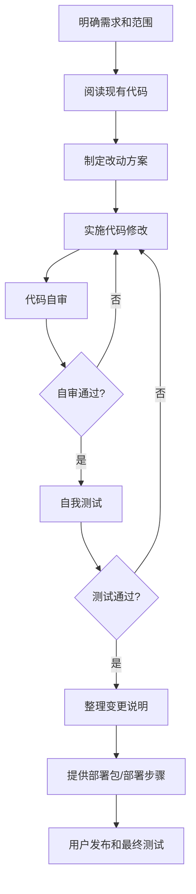

# DemoGo 工程流程与发布门禁

更新时间：2026-05-11

## 1. 基本原则

DemoGo 后续所有代码变更必须经过三道门：

1. 代码自审；
2. 自我测试；
3. 交付用户发布和最终测试。

没有完成前两步，不进入发布交付。

同时，DemoGo 后续每个版本都必须包含一项“架构演进检查”：

- 本版本新增功能是否继续扩大旧架构债务；
- 是否可以顺手把一小块旧逻辑迁移到更清晰的新架构；
- 是否参考了国际成熟平台的通用做法，但没有盲目照搬；
- 是否保持小步迁移，不做一次性大重构；
- 是否为后续模块化、任务队列、Worker、对象存储、OpenAPI、CLI、权限模型等能力留出边界。

原则是：

> 每个版本解决一个业务问题，同时偿还一小块架构债。

## 2. 标准工作流

## 3. 代码自审要求

每次改完代码后，必须先做自审。

自审重点：

- 是否只改了本次需求相关文件；
- 是否破坏已有注册、登录、上传、检测、发布、管理 Demo 流程；
- 是否影响线上用户数据；
- 是否引入不必要依赖；
- 是否有安全风险，例如上传绕过、路径穿越、敏感文件泄露；
- 是否有权限问题，例如用户能否操作别人的 Demo；
- 是否有数据迁移风险；
- 是否有清晰错误提示；
- 是否保留回滚可能；
- 是否符合 DemoGo 当前“低成本、可上线、可迭代”的原则。

涉及数据库时，还要额外检查：

- 表结构是否和数据模型一致；
- 迁移脚本是否可重复验证；
- 是否有备份方案；
- 是否有回滚方案；
- 是否会丢失现有 JSON 数据。

涉及架构演进时，还要额外检查：

- 是否符合 `DEMOGO_ARCHITECTURE_BENCHMARK.md` 中的目标架构方向；
- 是否把路由、服务、数据库、工具函数、前端交互继续混在一起；
- 是否可以拆出一个低风险模块，例如 service、route、middleware、repository、test；
- 是否保持原有 API 和部署方式兼容；
- 是否有测试覆盖迁移前后的关键流程。

## 4. 自我测试要求

代码自审通过后，必须做自我测试。

基础测试：

- 服务能启动；
- `/api/health` 正常；
- 用户注册正常；
- 用户登录正常；
- 当前用户信息正常；
- 上传 zip 正常；
- 项目检测正常；
- 发布 Demo 正常；
- Demo 链接可访问；
- Demo 下线、恢复、删除正常；
- 管理后台核心数据正常。

涉及检测和发布时，还要测试：

- 静态 `index.html` 项目；
- `dist/index.html` 项目；
- `build/index.html` 项目；
- 包含 `package.json` 和 build 命令的前端项目；
- 包含敏感文件的项目应被阻止；
- 包含 `node_modules`、`.git` 等文件的项目应被忽略；
- 包含表单和本地 API 的项目应给出规则体检提示。

涉及数据库时，还要测试：

- 建表脚本；
- JSON 到 MySQL 迁移；
- 迁移前后数据数量；
- 迁移后注册、登录、发布、管理流程；
- 数据库连接失败时的错误提示；
- 备份和回滚步骤。

## 5. 交付给用户前必须说明

测试通过后，交付给用户时必须说明：

- 本次改了什么；
- 哪些文件发生变化；
- 做过哪些自审；
- 做过哪些测试；
- 哪些测试通过；
- 哪些测试没有做以及原因；
- 是否需要备份；
- 是否需要停机；
- 部署步骤；
- 验证步骤；
- 回滚方式。

如果本版本包含架构演进，还必须说明：

- 本版本参考了哪些成熟平台的哪类做法；
- 本版本迁移了哪一小块旧架构；
- 哪些架构债仍然保留；
- 下一版本建议继续迁移哪一块。

## 6. 发布前检查清单

每次准备发布前，至少确认：

- 已备份线上数据；
- 已备份旧部署包；
- 部署包版本号正确；
- 数据库迁移脚本已测试；
- 服务重启步骤明确；
- 健康检查命令明确；
- 核心业务验证路径明确；
- 回滚方式明确。

## 7. 用户最终测试

交付后，由用户或用户指定人员做最终测试。

建议最终测试路径：

1. 打开首页；
2. 注册或登录；
3. 上传测试项目；
4. 检测项目；
5. 发布 Demo；
6. 打开 Demo 链接；
7. 更新 Demo；
8. 下线 Demo；
9. 恢复 Demo；
10. 删除下线 Demo；
11. 查看管理后台；
12. 验证关键数据没有丢失。

## 8. 适用于所有后续版本

该流程适用于：

- v0.1.7 数据库迁移；
- 发布体验优化；
- 项目检测增强；
- 规则体检报告；
- v0.2 表单托管；
- 后续 AI 能力；
- 套餐、订单、支付；
- 运维和部署脚本。

任何版本都不能跳过“自审”和“自测”。
