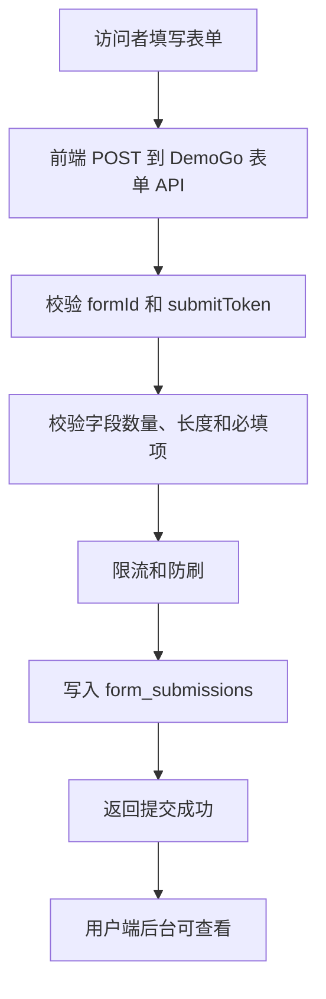

# DemoGo 表单托管说明

更新时间：2026-05-11

## 1. 一句话解释

表单托管的意思是：

> 用户发布的页面里有报名、预约、留言、反馈等表单时，不需要用户自己写后端和数据库，DemoGo 提供一个标准提交接口，帮用户保存这些表单数据，并在用户端展示和导出。

它解决的是：

> 页面能打开，但用户提交的数据不知道存到哪里。

## 2. 典型场景

适合表单托管的场景：

| 场景 | 数据 |
|---|---|
| 活动报名页 | 姓名、手机、单位、报名人数 |
| 预约体验页 | 姓名、联系方式、公司、需求 |
| 产品内测申请页 | 邮箱、公司、角色、申请理由 |
| 公司官网联系表单 | 姓名、电话、留言 |
| 简单订单意向页 | 商品、数量、联系人、地址备注 |
| 问卷反馈页 | 评分、意见、建议 |

不适合表单托管的场景：

- 用户注册登录系统；
- 真实支付订单；
- 库存管理；
- 多表关联数据库；
- 审批流；
- CRM；
- 完整后台管理系统。

## 3. 为什么不是自动解析客户 API

很多 AI 生成项目会写：

```js
fetch("/api/register", ...)
fetch("/api/submit", ...)
fetch("/api/order", ...)
```

但 DemoGo 不能自动判断这些 API 的真实业务逻辑，也不能替用户创建一个完整后端。

原因：

- API 名称不等于业务含义；
- 字段结构可能不稳定；
- 可能涉及权限、校验、支付、库存；
- 可能依赖外部服务；
- 自动接管风险高，容易误判。

所以正确方式不是 DemoGo 去猜用户的后端，而是：

> DemoGo 提供标准表单提交 API，用户项目按 DemoGo 的规则接入。

## 4. 用户流程

### 4.1 发布检测阶段

用户上传项目后，DemoGo 检测到：

- 页面里有表单字段；
- 项目调用了本地 API，例如 `/api/register`；
- 当前项目包里没有后端服务。

DemoGo 提示：

```text
检测到这个项目可能包含报名表单。
发现字段：姓名、手机号、公司、备注。
发现本地接口：/api/register。

当前 DemoGo 暂不托管自定义后端 API。
如果直接发布，页面可以打开，但报名数据可能无法保存。
你可以在后续版本中启用 DemoGo 表单托管。
```

### 4.2 创建表单阶段

用户在 DemoGo 用户端选择：

```text
为这个 Demo 创建数据表
```

填写或确认：

- 表单名称：活动报名表；
- 字段：姓名、手机号、公司、备注；
- 字段类型：文本、手机号、邮箱、数字、多行文本；
- 是否必填。

DemoGo 生成：

```text
formId: abc123
submit API: https://demogo.cn/api/forms/abc123/submit
```

### 4.3 接入代码阶段

DemoGo 生成一段给 AI 编程工具的指令：

```text
请把当前项目里的报名表提交逻辑改为提交到 DemoGo 表单托管接口：

POST https://demogo.cn/api/forms/abc123/submit

请求头：
Content-Type: application/json

提交字段：
- name
- phone
- company
- message

提交成功后显示“报名成功”。
提交失败后显示错误提示。
```

用户把这段话复制到 Cursor、Trae、Codex、Claude Code 等工具，让 AI 修改前端代码。

### 4.4 数据查看阶段

用户重新上传发布后，访问者在 Demo 页面提交表单。

数据进入 DemoGo，用户在控制台看到：

| 提交时间 | 姓名 | 手机 | 公司 | 备注 |
|---|---|---|---|---|
| 2026-05-11 12:30 | 张三 | 138****0000 | 某某公司 | 想参加活动 |

支持：

- 查看；
- 搜索；
- 删除；
- 导出 CSV；
- 后续同步飞书/腾讯文档。

## 5. 技术实现

### 5.1 数据表

表单托管至少需要三张表：

```text
forms
form_fields
form_submissions
```

`forms` 保存表单本身：

- 表单 ID；
- 用户 ID；
- Demo ID；
- 表单名称；
- 提交凭证；
- 状态。

`form_fields` 保存字段定义：

- 字段名；
- 显示名称；
- 字段类型；
- 是否必填；
- 排序。

`form_submissions` 保存提交数据：

- 表单 ID；
- Demo ID；
- 用户 ID；
- 提交内容；
- IP；
- 浏览器信息；
- 提交时间；
- 状态。

### 5.2 API

建议接口：

```text
POST /api/forms
GET /api/forms
GET /api/forms/:id
POST /api/forms/:id/submit
GET /api/forms/:id/submissions
GET /api/forms/:id/submissions.csv
DELETE /api/forms/:id/submissions/:submissionId
```

说明：

- 创建和查看表单需要登录；
- 提交表单不需要登录，但需要校验表单状态、提交凭证、频率和字段；
- 导出数据需要表单所属用户登录。

### 5.3 提交流程



### 5.4 安全控制

必须考虑：

- 每个表单有提交凭证；
- 限制单 IP 提交频率；
- 限制字段数量；
- 限制字段长度；
- 禁止提交超大 payload；
- 记录 IP 和 User-Agent；
- 用户只能查看自己的表单数据；
- 管理员可以禁用异常表单；
- 涉及手机号、邮箱等个人信息时，要在页面提示用户获得授权。

## 6. 和 v0.1.7 的关系

v0.1.7 不做正式表单托管。

v0.1.7 只做准备：

- 检测项目里是否有表单；
- 检测是否调用本地 API；
- 生成“数据可能无法保存”的规则报告；
- 为后续 `forms`、`form_fields`、`form_submissions` 保留表结构设计。

正式表单托管建议放到 v0.2.0。

## 7. 产品价值

表单托管会让 DemoGo 从“Demo 预览工具”升级为“轻量 MVP 验证工具”。

因为用户不只是把页面发出去，还能拿到真实反馈和数据。

这对 DemoGo 的商业价值很重要：

- 活动报名页可以真实收报名；
- 预约页可以真实收线索；
- 内测页可以真实收申请；
- 公司网站可以真实收咨询；
- 简单订单页可以真实收购买意向。

这比单纯静态托管更容易形成付费理由。
