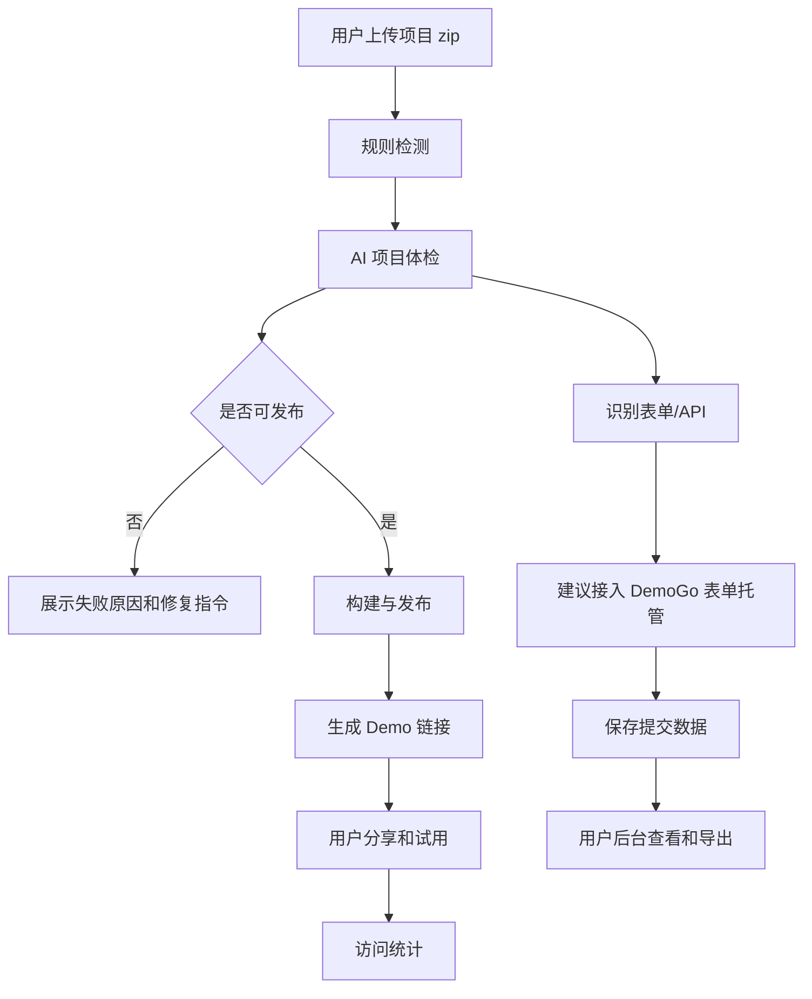
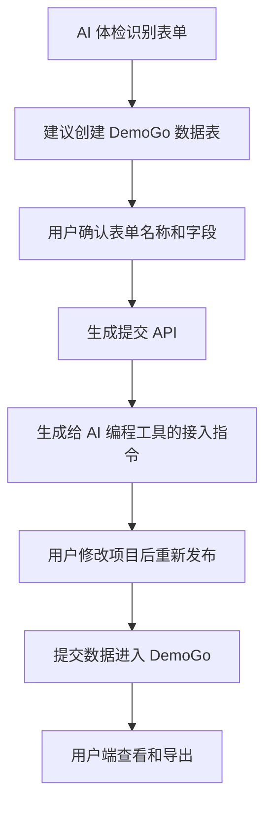

# DemoGo 产品架构

更新时间：2026-05-11

## 1. 产品总览

DemoGo 的产品架构围绕四件事展开：

1. 发布：让 AI 生成的小产品能被别人打开；
2. 体检：判断项目能否发布、哪些功能会失效；
3. 试用：让用户把链接发给客户、伙伴或内测用户；
4. 数据回收：收集报名、预约、留言、反馈和订单意向。

整体产品流程：

## 2. 三端结构

| 端 | 目标用户 | 当前文件 | 核心作用 |
|---|---|---|---|
| 官网首页 | 潜在客户 | `index.html` | 解释产品价值、引导试用和转化 |
| 用户端 | 注册用户 | `login.html` / `app.html` | 上传、检测、发布、管理 Demo、查看数据 |
| 管理端 | DemoGo 管理员 | `admin.html` | 管理用户、Demo、套餐、内容和运营数据 |

未来可以继续保持三端逻辑，但前端实现可从静态 HTML 逐步演进为组件化应用。

## 3. 用户端模块

用户端建议形成以下模块：

| 模块 | 当前状态 | 目标能力 |
|---|---|---|
| 账号与登录 | 已有 | 注册、登录、退出、后续找回密码和邮箱验证 |
| 发布工作台 | 已有雏形 | 上传 zip、检测、AI 体检、发布 |
| Demo 列表 | 已有 | 查看链接、状态、访问、有效期、操作 |
| 版本管理 | 部分已有 | 查看每次发布/更新记录，后续支持回滚 |
| 项目体检报告 | 待建设 | 项目类型、风险、表单、API、修复建议 |
| 表单数据 | 待建设 | 查看报名/预约/留言/反馈数据 |
| 套餐与用量 | 部分已有 | 套餐权益、剩余额度、升级提示 |
| 导出与集成 | 待建设 | CSV/Excel 导出，后续同步飞书/腾讯文档 |

## 4. 管理端模块

管理端不能只看列表，要逐步成为早期运营后台。

| 模块 | 目标能力 |
|---|---|
| 用户管理 | 查看用户、状态、套餐、注册时间、最后登录 |
| 套餐管理 | 人工开通 Free/Lite/Pro，记录变更历史 |
| Demo 管理 | 查看、下线、删除、恢复、查看检测报告 |
| 内容安全 | 处理违规 Demo、敏感内容、投诉 |
| 表单数据监管 | 查看异常提交量，必要时冻结表单 |
| 访问统计 | 总访问、Demo 访问、流量、趋势 |
| 发布失败分析 | 汇总失败原因，指导产品优化 |
| 审计日志 | 查看关键操作记录 |

## 5. AI 项目体检

AI 能力不做成孤立聊天机器人，而是嵌入发布流程。

### 5.1 规则检测

先由程序提取稳定信息：

| 检测对象 | 示例 |
|---|---|
| 项目结构 | `index.html`、`dist/index.html`、`build/index.html` |
| 包配置 | `package.json`、`scripts.build` |
| 表单元素 | `form`、`input`、`textarea`、`select` |
| API 调用 | `fetch("/api/submit")`、`axios.post(...)` |
| 字段名称 | `name`、`phone`、`email`、`company` |
| 风险文件 | `.env`、密钥文件、可执行脚本 |

### 5.2 AI 总结

AI 基于规则检测结果生成用户能看懂的报告：

- 项目类型：宣传页、活动报名页、预约页、管理后台、普通前端项目；
- 主要功能：展示、报名、留言、登录、订单意向；
- 发布结论：可发布、可发布但部分功能不可用、不可发布；
- 风险提示：本地 API、缺少 build 命令、敏感文件、表单数据无法保存；
- 修复建议：给出可复制到 AI 编程工具的提示词。

## 6. 表单托管产品设计

表单托管不是自动接管所有客户 API，而是 DemoGo 提供标准数据入口。

### 6.1 适合场景

| 场景 | 数据类型 |
|---|---|
| 活动报名 | 姓名、手机、单位、人数、备注 |
| 预约体验 | 姓名、联系方式、公司、需求 |
| 产品内测 | 邮箱、公司、角色、申请理由 |
| 联系我们 | 姓名、电话、留言 |
| 订单意向 | 商品、数量、联系人、地址备注 |
| 问卷反馈 | 评分、意见、标签 |

### 6.2 不适合场景

- 真实支付订单；
- 库存管理；
- 用户账号体系；
- 审批流；
- 多角色后台；
- 大规模 CRM。

### 6.3 用户流程

## 7. 套餐与商业化

当前不急着做在线支付，但套餐结构要进入产品架构。

| 套餐 | 目标用户 | 可能权益 |
|---|---|---|
| Free | 试用用户 | 少量在线 Demo、短有效期、有限发布次数 |
| Lite | 个人和轻量项目 | 更多 Demo、更长有效期、表单数据托管 |
| Pro | 高频试用和小团队 | 更多发布次数、更多数据量、导出和集成 |

早期商业化路径：

1. 人工收款；
2. 管理后台调整套餐；
3. 记录套餐变更；
4. 后续再接支付和订单系统。

## 8. 产品演进原则

- 先覆盖高频轻量 MVP，不做万能后端云平台；
- 先做标准数据接口，不自动解析所有客户 API；
- AI 能力先做体检、解释和修复建议，不直接自动改用户代码；
- 管理后台优先支撑人工运营，而不是一次性做复杂 SaaS 运营系统；
- 所有新功能都要能服务真实用户试用和商业验证。
