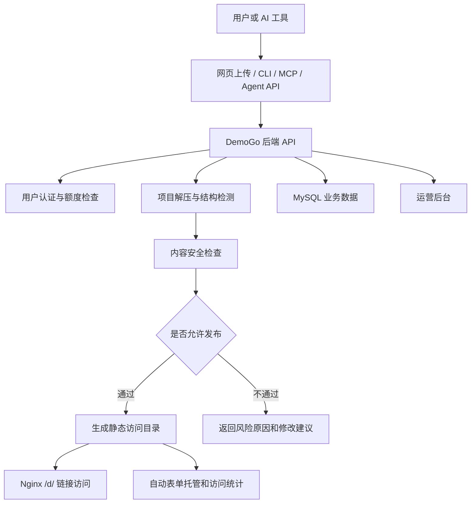

# DemoGo 项目全面复盘

日期：2026-05-18  
当前线上版本：v0.2.2  
当前阶段判断：已从“网页上传生成链接工具”进入“AI 编程产物试用发布平台”的早期验证阶段。

## 1. 一句话结论

DemoGo 的最终目标，不是做一个普通静态网页托管工具，而是成为 AI 编程工具生成产品后的“试用发布入口”：用户用 Codex、Cursor、Claude Code、Hammers Agent、OpenCode 等工具做出一个页面或产品原型后，可以快速生成一个能打开、能分享、能收集反馈的试用链接。

当前 v0.2.2 已经完成了 MVP 主路径：

```text
用户上传或让 AI 工具发布项目
  -> DemoGo 检查项目结构和内容风险
  -> 支持的项目生成试用链接
  -> 可在用户端管理项目、表单、发布记录
  -> 运营端查看用户、项目、失败原因、内容风险和升级申请
```

但 DemoGo 还没有进入“完整应用托管平台”阶段。当前明确不支持长期运行后端、数据库托管、支付、订单、登录系统后端、WebSocket、SSR runtime 和 AI Proxy。这个边界必须继续讲清楚，不能为了营销制造能力错觉。

## 2. 项目最终目标

### 2.1 产品愿景

DemoGo 要解决的是一个新问题：

> AI 编程工具越来越会做产品，但非技术用户很难把 AI 做出来的东西发给别人试用。

典型场景包括：

- 用 AI 做了一个产品落地页，想马上发给客户看。
- 用 AI 做了一个报名页、预约页、试用申请页，想收集真实信息。
- 用 AI 做了一个内部工具或 SaaS 界面原型，想给领导、客户、伙伴演示。
- 用 AI 做了一个小游戏、计算器、作品集、活动页，想生成一个可访问链接。
- 用 AI 做了一个更复杂的全栈项目，想知道哪些部分现在能试，哪些需要后续能力支持。

DemoGo 的长期定位应是：

```text
AI 生成项目
  -> DemoGo 识别、检查、发布
  -> 生成试用链接
  -> 收集试用反馈和表单数据
  -> 帮助用户验证产品价值
```

### 2.2 不应该成为的东西

短期内 DemoGo 不应该把自己包装成 Railway、Render、Vercel、Netlify、Zeabur 的完整替代品。那些平台的核心能力包括持续部署、后端服务运行、容器编排、数据库、域名证书、团队协作、日志监控和生产环境稳定性。

DemoGo 当前更适合从一个更窄但更明确的切口进入：

```text
AI 做好的页面和前端原型，先生成一个国内可访问、可分享、可验证的试用链接。
```

后续再逐步扩展到后端和数据库，而不是一开始就承诺完整云平台能力。

### 2.3 核心用户

DemoGo 的第一批核心用户不是专业开发者，而是：

- 创业者、产品经理、运营人员、销售人员。
- 会用 AI 编程工具但不懂部署的人。
- 需要向客户、领导、伙伴快速展示原型的人。
- 做活动页、报名页、宣传页、产品试用页的人。
- 使用 AI Agent 做项目，但不知道如何上线验证的人。

因此，产品表达必须始终面向非技术用户：

- 不要把“React、Vite、MCP、API、构建、SSR”放在用户理解的第一层。
- 应该说“页面能不能打开”“表单能不能收集”“链接能不能分享”“哪些功能现在暂不能用”。
- 技术概念只在用户需要排查问题或交给 AI 工具修复时出现。

## 3. 当前进展

### 3.1 当前版本状态

当前本地和线上部署均已到 v0.2.2。线上验证结果已经显示：

- `/api/health` 返回 `0.2.2`。
- Nginx API 代理返回 `0.2.2`。
- 首页、登录页、用户端页面返回 200。
- 管理后台返回 401 是正常现象，因为有 Basic Auth。
- `demogo-server.service` 处于运行状态。

这说明 v0.2.2 已成功部署，主服务正在运行。

### 3.2 当前已经支持的项目类型

当前支持：

| 类型 | 支持情况 | 说明 |
| --- | --- | --- |
| 纯 HTML 静态页面 | 支持 | 根目录有 `index.html` 可直接发布 |
| 单 HTML 页面 | 支持 | 如 `landing-page.html`、`home.html`，可自动作为首页发布 |
| 已构建前端产物 | 支持 | `dist/`、`build/`、`out/`、`public/` 下有可发布首页 |
| React/Vue/Vite 等前端源码 | 支持一部分 | 必须能通过构建命令生成静态页面 |
| 报名、预约、留言、试用申请表单 | 支持基础收集 | DemoGo 可自动识别并接管部分表单提交 |
| `.zip` 压缩包 | 支持 | 当前主要上传格式 |
| `.tar.gz`、`.tgz` | 支持 | 已纳入测试样本 |
| AI 工具通过 API 发布 | 支持 | 通过 Agent 发布 API |
| CLI 本地安装后发布 | 支持 | 当前是本地包安装，不是 npm 默认可用 |
| MCP / Codex Skill 交付包 | 支持初版 | 用于 AI 工具理解 DemoGo 发布流程 |

### 3.3 当前明确不支持的项目类型

当前不支持：

| 类型 | 当前状态 | 原因 |
| --- | --- | --- |
| Node.js 后端长期运行 | 不支持 | 需要容器、端口、进程管理、日志和资源限制 |
| Python 后端长期运行 | 不支持 | 同上 |
| Express/FastAPI/Flask/Django/NestJS 托管 | 不支持 | 属于应用托管，不是当前静态试用链接范围 |
| Next/Nuxt/Remix SSR runtime | 不支持 | 需要 Node runtime 和反向代理 |
| 自定义 `/api/*` 后端接口 | 不支持 | DemoGo 当前不会自动运行用户后端 |
| 自动数据库分配 | 不支持 | 需要数据隔离、备份、权限和资源管理 |
| 支付、订单、登录系统后端 | 不支持 | 涉及业务安全、数据安全和合规责任 |
| WebSocket、AI Proxy | 不支持 | 需要长期运行后端服务 |
| `.rar` | 不支持 | 当前只支持 zip、tar.gz、tgz |

这个边界很重要。用户上传一个带后端的项目时，DemoGo 可以发布其前端展示部分，但不能承诺后端逻辑可用。

### 3.4 当前核心功能模块

当前 DemoGo 已形成以下模块：

```text
用户系统
  -> 注册、登录、会话、套餐

项目发布
  -> 上传、检测、内容检查、发布、更新、下线、恢复、删除

表单托管
  -> 自动识别表单、创建托管表单、公开提交、查看提交记录

内容安全检查
  -> 发布前检查、风险拦截、后台记录、处理状态

AI 发布
  -> AI 发布口令、Agent API、CLI、MCP、Codex Skill

运营后台
  -> 用户、项目、升级申请、反馈、表单、内容风险、发布事件

部署运维
  -> 打包脚本、上传脚本、服务器部署脚本、回滚脚本、验证脚本
```

### 3.5 当前技术栈

| 层级 | 当前方案 |
| --- | --- |
| 前端 | React + Vite |
| 后端 | Node.js + Express |
| 数据库 | MySQL，后端通过兼容存储层读写 |
| 文件上传 | multer |
| 压缩包处理 | unzipper、tar |
| 内容安全 | 当前本地规则初筛，预留外部服务 |
| 静态访问 | Nginx |
| Demo 存放 | `/var/www/demogo-preview/d` |
| 服务运行 | systemd `demogo-server.service` |
| AI 发布 | Agent API + CLI + MCP + Codex Skill |
| 部署 | PowerShell 上传 + Bash 服务器部署 |

### 3.6 当前部署包

v0.2.2 已生成：

```text
dist\demogo-site-preview.zip
dist\demogo-server-v0.2.2.zip
dist\demogo-ops-scripts-v0.2.2.zip
dist\demogo-cli-v0.2.2.zip
dist\demogo-mcp-v0.2.2.zip
dist\demogo-codex-skill-v0.2.2.zip
```

这说明 DemoGo 已经不只是网页和服务端两个包，而是开始形成面向 AI 工具的交付体系。

## 4. 已完成的关键版本演进

### 4.1 v0.1.x：从上传 MVP 到可用产品雏形

v0.1.x 的主线是把最基础的“上传项目 -> 生成链接”打通，并逐步补齐真实试用所需能力。

关键进展：

- 支持静态项目上传和发布。
- 支持 `.zip`、`.tar.gz`、`.tgz`。
- 支持 `dist/build/out/public` 等常见前端产物。
- 支持部分源码项目构建。
- 增加注册登录、套餐额度、项目管理。
- 增加表单托管，让报名、预约、留言类页面有业务闭环。
- 增加用户端和管理后台。
- 增加项目更新、下线、恢复、删除。
- 增加内容安全检查，公开链接生成前必须先过审。
- 增加 AI 发布口令和 Agent 发布 API。
- 增加 SPA 刷新回退到 `index.html`。

这一阶段解决的是“能不能用”的问题。

### 4.2 v0.2.0：AI 工具一键发布正式路线启动

v0.2.0 的意义是：DemoGo 从手动上传工具，开始转向 AI 编程工具可调用的平台。

核心变化：

- CLI / MCP / Codex Skill 升级到正式体验方向。
- 用户可以在工作台生成 AI 发布口令。
- AI 工具可以按指令调用 DemoGo 发布能力。
- 用户端增加“让 AI 帮我生成链接”的路径。
- 运营后台增加 AI 发布相关观察指标。

这一阶段解决的是“如何让 AI 工具替用户发布”的问题。

### 4.3 v0.2.1：真实使用问题修正

v0.2.1 重点修复真实 AI 发布时暴露的问题：

- 项目名不能总是 `project`、`demo`、`demogo`，应优先从页面标题、主标题、文件名推断。
- 单个 `landing-page.html` 不应要求用户手动改成 `index.html`。
- 表单识别不能太宽，价格计算器、费用开关不能误判成报名表单。
- Token 是长期复用，不应让用户每次都重置。
- CLI 不可用时，AI 应说明原因，再走 MCP/API 兜底。

这一阶段解决的是“真实发布结果不像专业产品”的问题。

### 4.4 v0.2.2：AI 发布真实可用性强化

v0.2.2 重点把 AI 发布链路做扎实：

- CLI 包可本地安装。
- CLI、MCP、Agent API 返回结构进一步统一。
- 返回结果中包含项目名、发布方式、页面类型、内容检查、表单状态、额度信息。
- Codex Skill 明确支持与不支持边界。
- 新增真实项目测试集，覆盖 13 类典型项目。

这一阶段解决的是“AI 工具能不能稳定、清楚地向用户汇报发布结果”的问题。

## 5. 当前产品形态复盘

### 5.1 首页

首页的职责不是讲技术架构，而是让用户快速理解：

- DemoGo 是干什么的。
- 我为什么需要它。
- 我能拿它做什么。
- 哪些情况适合试。
- 试完能得到什么。

当前首页已经经历过多轮调整，但后续仍需要持续打磨。尤其要避免内部沟通话术直接出现在页面上，比如“支持就是支持，不支持就提前说明”“学习国际平台顺滑体验”等，这些是内部原则，不是用户语言。

面向用户的表达应类似：

```text
AI 做好的页面，马上变成一个能发给别人试用的链接。
```

而不是：

```text
我们支持静态部署、Agent API、CLI、MCP、内容审查。
```

### 5.2 用户端

用户端当前承担四件事：

- 创建和发布项目。
- 管理已发布链接。
- 查看表单提交。
- 让 AI 工具帮忙发布。

用户端应继续遵循一个原则：

```text
先让用户完成任务，再让用户理解细节。
```

因此最重要的体验不是堆功能，而是让用户知道：

- 我现在要上传什么。
- 平台检查出了什么。
- 能不能发布。
- 失败了该让 AI 怎么改。
- 成功后链接在哪里。
- 表单数据在哪里看。

### 5.3 管理后台

管理后台不是给普通用户看的，而是给运营人员判断平台运行情况的。

当前后台已经覆盖：

- 用户。
- 项目。
- 表单。
- 升级申请。
- 反馈。
- 内容检查记录。
- 发布事件。
- AI 发布来源。

后续后台重点不是做大屏，而是提升“发现问题和处理问题”的效率：

- 哪些发布失败最多。
- 哪些内容被拦截。
- 哪些用户达到额度。
- 哪些项目可能误导用户。
- 哪些表单产生了真实试用数据。

## 6. 当前技术架构复盘

### 6.1 当前架构图



### 6.2 发布流程

当前发布流程可以理解为：

```text
上传压缩包
  -> 判断文件格式是否支持
  -> 解压并检查路径安全
  -> 判断项目类型
  -> 检查是否包含敏感文件或不支持能力
  -> 如是源码项目，尝试构建静态产物
  -> 对源码和发布目录做内容安全检查
  -> 检查用户额度
  -> 生成项目 slug 和访问目录
  -> 写入项目记录、发布事件、审计日志
  -> 返回试用链接
```

这个流程的好处是清晰、低成本、容易验证。

当前的主要不足是：发布和构建仍偏同步化，复杂源码项目可能导致等待时间长。后续如果要支持更复杂项目，必须走异步任务。

### 6.3 AI 发布流程

当前 AI 发布流程是：

```text
用户在 DemoGo 工作台生成 AI 发布口令
  -> 把口令和平台地址交给 AI 工具
  -> AI 工具检查项目目录
  -> AI 工具打包项目
  -> AI 工具调用 CLI / MCP / Agent API
  -> DemoGo 执行同一套检查和发布逻辑
  -> AI 工具把链接、项目名、表单状态、内容检查结果返回给用户
```

关键原则：

- AI 发布不应该绕过内容检查。
- AI 发布不应该绕过额度。
- CLI、MCP、API 都应复用同一条后端发布链路。
- Token 是长期复用，不是每次发布都重置。
- CLI 不可用时可以走 API 兜底，但必须说清楚不是 CLI 发布成功。

### 6.4 内容安全检查

当前内容安全采用本地规则初筛：

- 诈骗和高风险金融引导。
- 博彩赌博。
- 色情低俗。
- 违法违禁交易。
- 恶意下载或攻击引导。
- 敏感信息收集。
- 外部联系方式导流。
- 支付或订单相关风险。
- 可疑外部链接。
- 可疑图片文件名。

当前能力边界：

- 能检查文本、HTML、JS、CSS、Vue、TS、JSON、Markdown 等文本内容。
- 能检查部分图片文件名风险。
- 不能识别图片、视频、音频里的真实内容。
- 还不是正式第三方内容安全服务。
- 当前策略是：检查不通过、疑似风险、检查异常，都不能直接生成公开链接。

下一步如果开始真实对外试用，应优先接入第三方内容安全服务，至少覆盖图片和更完整的文本风险。

### 6.5 表单托管

当前表单托管的业务意义很大：

```text
页面能打开
  -> 只能演示

页面能收集报名/预约/留言
  -> 可以验证真实业务需求
```

当前 DemoGo 可以识别部分报名、预约、留言、试用申请类表单，并自动开启基础表单收集。用户可以在工作台查看提交记录。

需要继续注意两点：

- 不能把所有 `<form>` 都当成业务表单，比如价格计算器、费用切换、模型参数输入。
- 如果用户的页面依赖自定义 `/api/submit`，DemoGo 当前不会运行该后端，只能通过 DemoGo 表单托管接管简单提交。

## 7. 当前核心问题与风险

### 7.1 产品认知风险

用户容易误以为：

- 有表单就一定能保存数据。
- 有 `/api/submit` 就一定能调用成功。
- 有后端代码就一定能运行。
- 有 Next.js 就一定能上线。
- 有付款按钮就能收款。

如果 DemoGo 不提前说明边界，用户会把“不支持”理解成“平台坏了”。

解决方向：

- 上传前说清楚适合什么。
- 检测报告说清楚问题是什么。
- 失败后给 AI 可执行的修改建议。
- 首页和工作台用用户语言表达能力边界。

### 7.2 技术安全风险

源码项目构建、用户上传内容、公开链接和表单收集都会带来风险：

- 用户上传恶意文件。
- 构建脚本执行危险行为。
- 页面内容违规。
- 表单收集敏感信息。
- AI 工具误把密钥打包进项目。

当前已做的缓解：

- 压缩包路径安全检查。
- 敏感文件拦截。
- 内容安全本地规则。
- AI Skill 明确不要打包 `.env`、密钥、`node_modules`。
- 内容检查不通过时默认不发布。

后续需要加强：

- Docker 隔离构建。
- 第三方内容安全。
- 文件病毒/恶意脚本扫描。
- 更明确的数据和隐私提示。

### 7.3 体验风险

用户已多次指出前端体验问题，包括：

- 首页排版和文案不够吸引人。
- 用户端布局不符合直觉。
- 管理后台内部词汇过多。
- 操作路径不够顺滑。
- 部分内容像内部策略，不像面向用户的产品语言。

当前已经做过多轮前端重构，但未来仍应把“产品包装和审美”作为持续版本任务，而不是只修功能。

### 7.4 架构扩展风险

当前架构适合 MVP，但不适合直接承载复杂应用托管。

主要问题：

- 发布流程仍偏同步。
- 构建隔离还不够生产级。
- 没有独立任务队列。
- 没有容器化运行用户后端。
- 没有数据库自动分配。
- 没有完整日志、监控、资源限制和清理策略。

如果后续要支持后端项目，必须先升级架构。

## 8. 后续实现步骤

### 8.1 近期目标：把 v0.2.x 做成真实可试用 MVP

近期不要急着承诺完整后端托管。建议 v0.2.x 继续围绕三件事打磨：

1. AI 工具发布链路稳定。
2. 项目检测和失败提示足够清楚。
3. 真实试用数据能沉淀。

建议后续 v0.2.x 任务：

- CLI 安装和分发优化。
- `npx demogo` 正式可用前的清晰替代路径。
- AI 发布全链路测试继续扩充。
- 用户端发布结果页优化。
- 失败原因分类优化。
- 内容安全第三方服务接入方案设计。
- 真实样本库持续扩大到 50 个以上。
- 后台增加试用观察指标。

### 8.2 中期目标：异步发布任务

当前同步发布适合小项目，但不适合复杂源码项目。

中期应改为：

```text
用户上传项目
  -> 立即创建发布任务
  -> 返回任务 ID
  -> 后台执行检查、构建、发布
  -> 前端轮询任务状态
  -> 成功后展示链接
  -> 失败后展示日志和 AI 修改建议
```

需要新增：

- `deployment_jobs` 数据表。
- 发布任务状态：排队中、检查中、构建中、内容检查中、发布中、成功、失败。
- 发布日志。
- 失败原因分类。
- 重试能力。
- 超时处理。

业务意义：

- 用户不会因为等待太久看到浏览器错误页。
- 源码项目构建失败可以更清楚地解释。
- 后续 Docker 构建和后端运行都可以复用任务系统。

### 8.3 中期目标：Docker 隔离构建

如果继续支持源码项目构建，就必须逐步从宿主机构建转向 Docker 隔离。

目标流程：

```text
源码项目
  -> 临时 Docker 容器
  -> 安装依赖
  -> 执行构建
  -> 提取 dist/build/out
  -> 删除容器
```

关键要求：

- CPU、内存、时间限制。
- 禁止访问危险宿主机路径。
- 控制网络访问。
- 构建日志可查看。
- 构建失败可解释。
- 构建产物安全检查。

业务意义：

- 提升平台可信度。
- 降低用户项目对服务器的安全风险。
- 为未来后端托管打基础。

### 8.4 中长期目标：Node 后端托管

当 DemoGo 要支持更多 AI 生成的真实产品时，Node 后端是第一个应考虑的后端类型。

支持范围应从最小能力开始：

```text
检测 package.json
  -> 判断是否有 start 脚本
  -> 构建镜像或运行容器
  -> 分配内部端口
  -> Nginx/Caddy 路由 /api/* 到容器
  -> 静态前端仍由 DemoGo 托管
  -> 查看日志和运行状态
```

但必须先具备：

- 容器隔离。
- 环境变量管理。
- 端口分配。
- 健康检查。
- 日志查看。
- 自动停止和清理。
- 资源限制。

不建议在没有这些基础前直接支持后端。

### 8.5 中长期目标：数据库托管或数据库接入

AI 生成项目中，报名、订单、用户管理、CRM、后台系统都会需要数据库。

可选路径：

| 路径 | 优点 | 缺点 | 建议 |
| --- | --- | --- | --- |
| 每项目 SQLite | 简单、低成本 | 并发和管理能力弱 | 可作为早期原型 |
| 共享 MySQL/PostgreSQL 分库/分 schema | 能力更强 | 隔离、备份、权限更复杂 | 中期可考虑 |
| 用户自带数据库 | 平台负担小 | 非技术用户门槛高 | 面向高级用户 |
| Supabase 等外部集成 | 快速补齐能力 | 国内访问和账号体系有不确定性 | 可作为补充 |

建议：

- 短期继续用 DemoGo 表单托管覆盖 60%-70% 的简单数据收集需求。
- 不急着承诺完整数据库托管。
- 等真实样本足够多后，再决定数据库路线。

### 8.6 长期目标：成为 AI 工具发布协议层

长期看，DemoGo 不应只靠网页上传，而应成为 AI 编程工具默认可调用的发布目标。

路线：

```text
Agent 发布 API
  -> CLI
  -> MCP Server
  -> Codex Skill / Cursor 指令 / Claude Code 指令
  -> npm 正式包
  -> 插件市场或工具市场
  -> GitHub 导入和自动发布
```

核心不是“做一个插件”，而是形成一套稳定协议：

- AI 能判断项目能否发布。
- AI 能打包正确文件。
- AI 能调用 DemoGo。
- AI 能理解失败原因。
- AI 能修改项目后重试。
- AI 能把成功结果用人话告诉用户。

## 9. 具体技术路径建议

### 9.1 第一阶段：稳定静态发布和 AI 发布

目标：让 DemoGo 对静态页面和前端原型“稳定、可信、好理解”。

技术任务：

- 保持 `/api/deploy` 和 `/api/agent/deploy` 同一核心逻辑。
- 完善项目检测规则。
- 完善真实项目 fixture 测试。
- 完善 CLI 本地安装。
- 准备 npm 发布条件。
- 强化 Agent API 返回结构。
- 强化失败提示和 AI 修复建议。

验收标准：

- 纯 HTML、单 HTML、dist/build/out/public、React/Vite、Vue/Vite 样本稳定通过。
- 后端、SSR、无 build 命令项目能被清楚拦截。
- AI 工具返回的项目名、链接、发布方式、内容检查、表单状态准确。

### 9.2 第二阶段：异步任务系统

目标：解决源码项目构建等待、Nginx 超时、日志不可见问题。

技术任务：

- 新增发布任务表。
- 发布接口返回任务 ID。
- 前端增加任务状态页。
- 后端后台执行任务。
- 发布事件改为任务日志。
- 支持失败重试。

验收标准：

- 大项目上传后页面不会卡死。
- 用户能看到“正在检查、正在构建、正在发布”。
- 构建失败能看到具体原因和给 AI 的修复建议。

### 9.3 第三阶段：Docker 构建隔离

目标：让源码构建从“能用”变成“相对安全可控”。

技术任务：

- 引入 Docker 构建执行器。
- 设置资源限制。
- 构建目录挂载。
- 提取产物。
- 清理容器。
- 构建日志归档。

验收标准：

- 构建失败不会影响宿主机。
- 超时和资源超限能被清楚处理。
- 后续可平滑扩展到后端容器运行。

### 9.4 第四阶段：内容安全正式化

目标：降低平台对违规内容的连带风险。

技术任务：

- 接入阿里云/腾讯云等内容安全服务。
- 文本和图片都要覆盖。
- 本地规则作为前置筛查。
- 外部服务异常时默认 fail closed。
- 后台支持人工处理记录。
- 用户端展示合适的非技术提示。

验收标准：

- 违规文本被拦截。
- 二维码、支付码、敏感图片可进入审核。
- 后台可查看风险原因和处理状态。

### 9.5 第五阶段：后端项目最小托管

目标：从“试用链接平台”扩展到“轻量应用试用平台”。

技术任务：

- Node 后端检测。
- 容器运行。
- 内部端口路由。
- `/api/*` 转发。
- 日志查看。
- 健康检查。
- 自动停用过期项目。

验收标准：

- 简单 Express 项目可以作为试用 Demo 运行。
- 资源限制生效。
- 用户能看到运行状态和错误日志。

### 9.6 第六阶段：数据库和完整应用能力

目标：支持报名、订单、用户管理、CRM 等更完整原型。

技术任务：

- 数据库方案选择。
- 项目级数据库隔离。
- `DATABASE_URL` 注入。
- 数据备份和清理。
- 表结构迁移策略。
- 用户数据导出。

验收标准：

- 简单 CRUD 应用可运行。
- 数据不会因容器重启丢失。
- 用户能导出自己的数据。

## 10. 后续版本建议

### 10.1 v0.2.3 建议方向

建议 v0.2.3 不要急着进入后端托管，而是做“真实试用稳定版”。

建议包含 2-3 个任务：

1. CLI 分发与安装体验优化。
   - 准备 npm 发布。
   - 明确 `npx demogo` 何时可用。
   - 工作台指令根据当前平台地址自动生成。

2. AI 发布线上抽测和失败体验优化。
   - 用真实项目跑 CLI / MCP / API。
   - 记录 AI 工具实际反馈。
   - 修正项目名、表单状态、失败提示。

3. 首页和用户端文案继续营销化。
   - 首页更像面向客户的产品页。
   - 用户端减少内部词汇。
   - 支持和不支持用非技术语言表达。

### 10.2 v0.2.4 建议方向

建议做“异步发布任务设计与最小实现”。

包含：

- 发布任务模型。
- 任务状态接口。
- 前端进度页。
- 发布日志。
- 失败重试。

这会为后续 Docker 构建和后端托管打基础。

### 10.3 v0.2.5 建议方向

建议做“内容安全正式化准备版”。

包含：

- 第三方内容安全服务选型。
- 外部审核接口封装。
- 图片审核接入。
- 后台人工处理流程。
- 内容风险用户提示优化。

### 10.4 v0.3.0 建议方向

v0.3.0 才适合讨论“后端项目和数据库托管”的第一版。

建议目标：

- 只支持 Node.js 后端最小运行。
- 不同时支持 Python、数据库、支付、SSR。
- 先用一个清晰场景验证：前端页面 + 简单 Express API。

## 11. 商业化和试用路径

### 11.1 近期商业验证重点

DemoGo 现在最需要验证的不是技术炫技，而是：

- 非技术用户是否真的愿意用它发布 AI 生成的项目。
- 用户最常上传什么类型项目。
- 失败最多的原因是什么。
- 表单收集是否能形成真实业务价值。
- AI 工具发布是否比网页上传更顺滑。
- 用户是否愿意为更多链接、更长保留、更高额度付费。

### 11.2 试用人群建议

优先找这几类用户：

- 正在用 AI 做页面的创业者。
- 用 Cursor/Codex/Claude Code 做 Demo 的产品经理。
- 做培训、活动、报名页的人。
- 做企业内部展示原型的人。
- 做 AI 工具导航、作品集、宣传页的人。

先不要找重后端、重支付、重数据库的项目做第一批试用，否则容易暴露当前阶段不该承诺的能力。

### 11.3 关键观察指标

建议后台继续强化这些指标：

- 发布成功数。
- 发布失败数。
- AI 发布次数。
- 网页上传次数。
- 内容检查拦截数。
- 常见失败原因。
- 表单自动开启数。
- 表单提交数。
- 用户升级申请数。
- 项目分享访问量。

这些指标比复杂报表更重要，因为它们直接回答“产品有没有被真实使用”。

## 12. 当前最重要的原则

### 12.1 支持就是支持，不支持就是不支持

不要用“实验能力”模糊表达。用户需要明确知道：

- 当前能发布什么。
- 当前不能发布什么。
- 失败后能不能改。
- 什么时候需要后续版本。

### 12.2 不要把内部策略写给用户看

内部可以说：

- 先解决国内试用现实问题。
- 学习国际平台顺滑体验。
- 支持就是支持，不支持提前说明。
- 不要制造能力错觉。

但用户页面应该转成：

- “适合上传：网页、活动页、报名页、产品原型。”
- “暂不适合：需要后端、数据库、支付、登录系统的完整应用。”
- “如果发布失败，DemoGo 会告诉你原因，并给出可以交给 AI 修改的建议。”

### 12.3 版本节奏不能被临时问题带偏

DemoGo 已经形成主线：

```text
上传发布 MVP
  -> 表单托管
  -> 内容安全
  -> Agent API
  -> CLI
  -> MCP
  -> Codex Skill
  -> AI 工具一键发布
  -> 异步任务和 Docker 构建
  -> 后端与数据库托管
```

临时发现的问题应该归入当前版本的子任务或下个版本的修复项，而不是随意改版本定位。

### 12.4 先做可验证的真实价值

DemoGo 当前最有价值的切口是：

```text
让 AI 做出来的东西，尽快被别人打开、试用、反馈。
```

不要过早陷入完整云平台复杂度。真正能带来早期用户反馈的，是稳定链接、清晰提示、顺滑发布、表单收集和 AI 工具接入。

## 13. 当前推荐下一步

建议下一步先做 v0.2.3，定位为：

```text
DemoGo v0.2.3：真实试用与 AI 发布体验优化版
```

建议范围：

1. CLI / npx 分发路径确认。
2. 线上真实项目抽测。
3. AI 工具发布反馈优化。
4. 首页和用户端文案继续面向用户重写。
5. 后台试用观察指标小幅增强。

不建议下一步马上做：

- 完整后端托管。
- 数据库托管。
- 支付系统。
- 多语言后端支持。
- 大规模云平台架构重写。

这些应该放到异步任务和 Docker 隔离之后。

## 14. 最终判断

DemoGo 当前已经不是一个零散 Demo，而是有清晰方向的 MVP：

- 有明确目标用户。
- 有可运行线上版本。
- 有上传发布主链路。
- 有表单收集这个业务闭环。
- 有内容安全底线。
- 有 AI 发布 API、CLI、MCP、Skill 的集成路线。
- 有版本演进记录和部署体系。

当前最大挑战不是“能不能继续写功能”，而是：

1. 把用户能感知到的体验继续做顺。
2. 把支持边界讲清楚。
3. 用真实试用样本验证下一步优先级。
4. 在进入后端托管前补齐异步任务、Docker 隔离和安全体系。

如果坚持这条路线，DemoGo 可以从“AI 页面试用链接工具”逐步升级为“AI 编程产物发布与验证平台”。这是一个合理、可落地、也有商业想象空间的方向。
