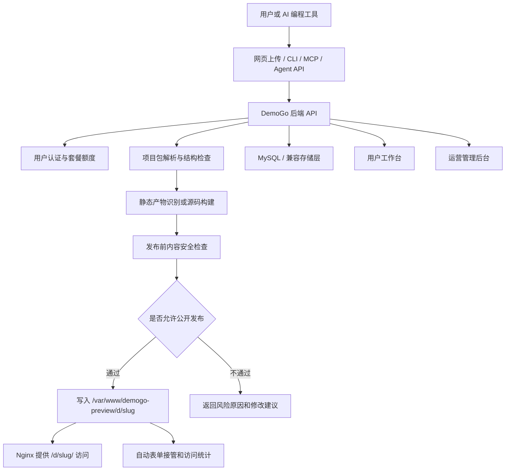
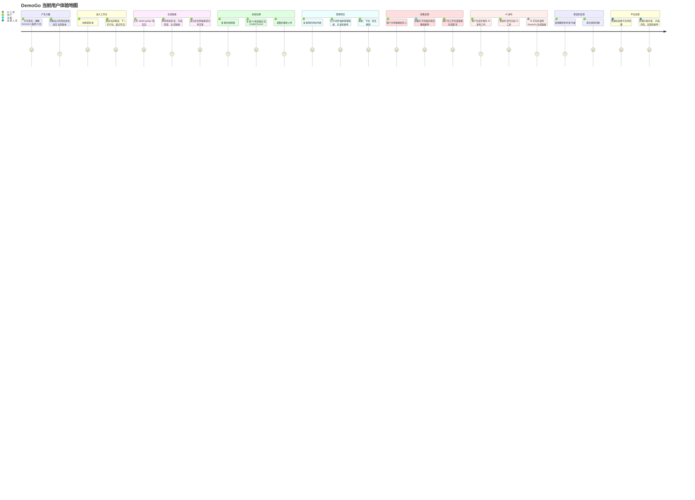

# DemoGo 项目全面复盘报告

日期：2026-05-19  
当前线上版本：v0.2.4  
线上地址：https://demogo.cn  
线上健康检查：`/api/health` 已返回 `{"ok":true,"service":"demogo-server","version":"0.2.4"}`

## 1. 项目概况

### 1.1 项目目标

DemoGo 的核心目标不是做一个普通的静态网页托管工具，而是成为“AI 编程工具产物的试用链接生成平台”。

一句话定位：

> 让非技术用户把 AI 做好的页面、活动页、报名页、作品集、产品原型，快速变成一个别人能打开、能填写、能反馈的试用链接。

DemoGo 现在要解决的真实问题是：

- AI 编程工具已经能帮用户做页面和产品原型，但非技术用户不会部署。
- 用户不想给别人发截图、录屏、压缩包或本地文件，而是想发一个正式链接。
- 很多 AI 生成项目并不是完整上线产品，而是需要先拿给客户、同事、学员、潜在用户试用验证。
- 活动报名、课程招生、产品预约、留言反馈等场景，需要一个简单的数据回收入口。
- 用户需要知道“这个项目现在能不能试”“哪些功能暂时不能用”“失败后该让 AI 怎么改”。

因此 DemoGo 当前阶段的产品目标是：

```text
AI 做好页面
  -> DemoGo 检查项目
  -> 生成试用链接
  -> 分享给别人打开
  -> 收集基础表单和反馈
  -> 帮助用户判断产品是否值得继续投入
```

长期方向是：

```text
AI 编程产物发布入口
  -> 静态页面试用
  -> 表单和反馈收集
  -> AI 工具一键发布
  -> 异步构建和隔离执行
  -> 后端项目和数据库托管
  -> 更完整的 AI 应用试用平台
```

### 1.2 当前进展

当前 DemoGo 已经从“上传网页生成链接的 MVP”推进到“具备真实试用能力的早期平台”。

已经完成的关键能力：

| 模块 | 当前状态 | 说明 |
| --- | --- | --- |
| 正式域名 | 已完成 | `https://demogo.cn` 已可访问 |
| ICP 备案展示 | 已完成 | 页面展示 `鄂ICP备2026023999号` |
| 用户注册登录 | 已完成 | 支持普通用户进入工作台 |
| 项目上传发布 | 已完成 | 支持上传项目包生成 `/d/xxx/` 试用链接 |
| 项目检测 | 已完成 | 检查入口文件、构建能力、敏感文件、后端依赖等 |
| 内容安全检查 | 已完成本地规则版 | 发布前检查高风险内容，不通过不生成公开链接 |
| 表单自动收集 | 已完成基础版 | 对报名、预约、留言、留资类表单自动接管 |
| 项目管理 | 已完成 | 支持查看、复制、更新、下线、恢复、删除 |
| 套餐额度 | 已完成 | Free / Lite / Pro，限制在线项目、发布次数、表单数 |
| 运营后台 | 已完成 | 查看用户、项目、升级申请、反馈、表单、内容检查 |
| AI 发布 API | 已完成 | `POST /api/agent/deploy` |
| AI 发布口令 | 已完成 | 用户生成后长期复用，不需要每次重置 |
| DemoGo CLI | 已完成本地安装包 | 当前不是 npm 默认可用，需要本地安装 |
| MCP Server | 已完成初版 | 给支持 MCP 的 AI 工具调用 |
| Codex Skill | 已完成初版 | 指导 Codex 如何发布到 DemoGo |
| 三端体验重构 | v0.2.4 已完成 | 首页、用户端、管理端已做一次整体重构 |

当前已部署版本：

- 线上服务：v0.2.4
- 首页：`https://demogo.cn`
- 用户端：`https://demogo.cn/app.html`
- 登录页：`https://demogo.cn/login.html`
- 管理端：`https://demogo.cn/admin.html`
- API 健康检查：`https://demogo.cn/api/health`

当前明确不支持：

- Node.js / Python 后端长期运行。
- Express、FastAPI、Flask、Django、NestJS 等后端服务托管。
- Next、Nuxt、Remix 等 SSR 运行时。
- 用户项目自带 `/api/*` 后端接口自动运行。
- 数据库自动分配。
- 支付、订单、登录系统后端。
- WebSocket、AI Proxy、定时任务。
- `.rar` 压缩包。

### 1.3 下一步计划

建议下一阶段不要立刻跳到完整后端托管，而是先把 v0.2.x 做成真实试用可用、可观察、可增长的产品。

#### 近期：v0.2.5 建议方向

定位：真实用户试用反馈优化版。

建议包含 2 到 3 个任务：

1. 真实试用体验继续打磨
   - 检查首页、用户端、管理端真实打开后的感受。
   - 优化新用户第一次发布的引导。
   - 优化失败提示，让用户能直接复制给 AI 工具修改。
   - 优化发布成功页，让用户知道下一步是复制链接、发给谁、看什么反馈。

2. 试用数据观察增强
   - 更清楚展示访问量、表单提交、发布成功/失败原因。
   - 管理端突出“真实试用是否顺畅”。
   - 支持表单数据更方便查看和导出。

3. AI 发布链路继续产品化
   - CLI 安装说明更清晰。
   - 判断是否准备正式 npm 发布。
   - 继续完善 Codex / Cursor / Claude Code 的指令模板。
   - 让 AI 工具返回结果时更像产品报告，而不是技术日志。

#### 中期：v0.2.x 后续重点

- 发布任务系统继续完善：更稳定的后台任务、进度、日志、失败重试。
- 内容安全接入第三方服务：文本、图片、二维码、支付引导都要逐步覆盖。
- 项目样本库扩展：从 13 类样本扩展到更多真实 AI 生成项目。
- CLI / MCP / Skill 进入更稳定分发阶段。

#### 长期：v0.3.0 以后

只有在静态试用链路稳定后，再进入后端项目托管。

建议路线：

```text
异步发布任务稳定
  -> Docker 隔离构建稳定
  -> Node 后端最小托管
  -> 日志、端口、健康检查、资源限制
  -> 数据库托管或数据库接入
  -> 更完整的应用试用平台
```

## 2. 技术方案

### 2.1 整体技术架构

当前架构是典型的低成本 MVP 架构，优点是简单、可部署、可快速迭代。



当前技术选型：

| 层级 | 当前方案 | 业务含义 |
| --- | --- | --- |
| 前端 | React + Vite | 快速构建首页、用户端、管理端 |
| 后端 | Node.js + Express | 负责上传、检测、发布、用户、后台和 API |
| 数据库 | MySQL + 兼容存储层 | 保存用户、项目、表单、审查、升级申请等数据 |
| 文件上传 | multer | 接收 zip、tar.gz、tgz 项目包 |
| 压缩包处理 | unzipper + tar | 解析用户上传的项目包 |
| 静态访问 | Nginx | 对外提供首页、工作台和用户项目访问 |
| 用户项目目录 | `/var/www/demogo-preview/d` | 生成的试用项目落在这里 |
| 后端服务运行 | systemd | `demogo-server.service` 监听 3001 |
| 正式域名 | `https://demogo.cn` | 面向真实用户试用 |
| AI 集成 | Agent API + CLI + MCP + Codex Skill | 让 AI 工具可以代替用户发布 |
| 内容安全 | 本地规则初筛 | 发布前拦截明显高风险内容 |
| 部署方式 | PowerShell 上传 + Bash 部署脚本 | 当前适合单机 MVP 快速迭代 |

### 2.2 具体技术实现方案

#### 2.2.1 前端三端

当前前端包含四个主要页面：

- 首页：`web/src/pages/HomePage.tsx`
- 登录页：`web/src/pages/LoginPage.tsx`
- 用户端：`web/src/pages/UserDashboard.tsx`
- 管理端：`web/src/pages/AdminDashboard.tsx`

首页职责：

- 用非技术语言讲清 DemoGo 的价值。
- 强调“别只发截图，把 AI 做好的页面变成试用链接”。
- 展示适合场景：活动报名、课程招生、作品集、产品原型、客户演示。
- 展示边界：当前重点支持页面试用和基础表单，不支持完整后端、支付、订单、数据库。

用户端职责：

- 让用户生成新链接。
- 查看和管理试用项目。
- 使用 AI 发布指令。
- 查看表单记录、发布记录、套餐额度。
- 提交反馈。

管理端职责：

- 看今日待处理。
- 处理升级申请。
- 查看用户问题。
- 查看内容检查结果。
- 查看报名/留言。
- 查看用户和项目。

#### 2.2.2 后端 API

当前关键 API：

| API | 用途 |
| --- | --- |
| `GET /api/health` | 健康检查和版本确认 |
| `POST /api/auth/register` | 用户注册 |
| `POST /api/auth/login` | 用户登录 |
| `GET /api/me` | 获取当前用户 |
| `POST /api/inspect` | 上传前项目检测 |
| `POST /api/deployment-jobs` | 用户端异步创建发布任务 |
| `GET /api/deployment-jobs/:id` | 查询发布任务状态 |
| `POST /api/deploy` | 用户端同步发布兼容接口 |
| `POST /api/agent/deploy` | AI 工具发布接口 |
| `GET /api/demos` | 用户项目列表 |
| `GET /api/demos/:id` | 项目详情 |
| `POST /api/demos/:id/update` | 更新项目 |
| `POST /api/demos/:id/offline` | 下线项目 |
| `POST /api/demos/:id/restore` | 恢复项目 |
| `POST /api/demos/:id/delete` | 删除项目 |
| `GET /api/forms` | 用户表单列表 |
| `POST /api/public/forms/:token/submit` | 公开表单提交 |
| `POST /api/agent-token` | 生成或重置 AI 发布口令 |
| `GET /api/admin/overview` | 管理端概览 |
| `GET /api/admin/content-reviews` | 内容检查记录 |
| `GET /api/admin/forms` | 管理端表单记录 |

#### 2.2.3 发布主流程

用户上传项目包后，系统执行：

```text
接收项目包
  -> 判断是否是 .zip / .tar.gz / .tgz
  -> 解压前检查路径安全
  -> 过滤无关文件
  -> 拦截敏感文件
  -> 识别项目类型
  -> 判断是否可发布
  -> 如需要，执行 npm install / npm run build
  -> 找到 dist/build/out/public 或 index.html
  -> 发布前内容安全检查
  -> 生成 slug 和公开访问目录
  -> 写入项目记录
  -> 自动识别并接管基础表单
  -> 注入访问统计脚本
  -> 返回试用链接
```

当前异步发布任务的逻辑：

- 用户端优先调用 `/api/deployment-jobs`。
- 后端立即返回任务 ID。
- 后端在当前服务进程内继续执行检查、构建、内容审查和发布。
- 前端轮询任务状态。
- 成功后展示链接，失败后展示原因和 AI 修改建议。

这已经解决了一部分“发布过程等待时间长”的问题，但还不是完整生产级任务队列。后续如果支持更复杂项目，需要独立 Worker 和更强的任务持久化。

#### 2.2.4 项目识别逻辑

系统主要看这些信号：

- 是否有 `index.html`。
- 是否有 `dist/index.html`、`build/index.html`、`out/index.html`、`public/index.html`。
- 是否只有一个可作为首页的 HTML 文件，比如 `landing-page.html`。
- 是否有 `package.json`。
- `package.json` 是否有 `scripts.build`。
- 是否像后端项目，例如 `server.js`、`app.js`、`start` 脚本包含 `node`、`nest` 等。
- 是否像 SSR 项目，例如 Next、Nuxt、Remix。
- 是否包含本地 `/api/*` 调用。
- 是否包含报名、预约、留言类表单字段。

判断结果会转换成用户能理解的话：

- 普通网页项目。
- 单页网页项目。
- 已生成的网页项目。
- AI 生成的网页项目。
- 需要服务器的项目。
- 暂未识别。

#### 2.2.5 构建方案

对源码项目，当前处理方式：

- 如果有 `package.json` 和 `build` 命令，尝试构建。
- 有 `package-lock.json` 时执行 `npm ci`，否则执行 `npm install`。
- 然后执行 `npm run build`。
- 构建后寻找 `dist/index.html`、`build/index.html`、`out/index.html`。
- 找到后，把产物提升为最终发布目录。

当前配置中支持两种构建路径：

- 宿主机构建：直接在服务器上执行 npm。
- Docker 构建：如果配置和环境满足，可用 Docker 临时构建前端产物。

需要特别说明：

> 这不等于 DemoGo 已经对外承诺“Docker 后端托管”。当前 Docker 只可能用于前端源码构建辅助，不代表支持用户后端长期运行。

#### 2.2.6 内容安全方案

当前采用本地规则初筛，发布前必须通过内容检查。

重点拦截或要求人工确认：

- 诈骗、高风险金融引导。
- 博彩赌博。
- 色情低俗。
- 违法违禁交易。
- 恶意下载和攻击引导。
- 敏感信息收集。
- 外部联系方式或不明导流。
- 支付、订单、收款相关风险。
- 可疑外部链接。
- 疑似二维码、支付码图片文件名。

当前能力边界：

- 能检查 HTML、JS、CSS、TS、Vue、JSON、Markdown 等文本内容。
- 能对图片文件名做有限风险提示。
- 不能识别图片、视频、音频中的真实内容。
- 还没有真正调用阿里云、腾讯云等第三方内容安全接口。
- 当前策略是 fail closed：检查不通过、需要人工确认或检查失败时，不生成公开链接。

#### 2.2.7 自动表单收集方案

当前 DemoGo 能识别基础表单，并在发布时自动接管。

识别逻辑：

- 检测 `input`、`textarea`、`select`。
- 判断字段名或标签是否包含姓名、手机、邮箱、微信、公司、留言、备注等。
- 如果像报名、预约、留言、留资表单，就自动开启表单收集。
- 如果只是价格输入、费用开关、计算器控件，就不自动接管。

接管方式：

```text
识别表单字段
  -> 创建 DemoGo 表单记录
  -> 生成公开提交地址
  -> 向用户项目 index.html 注入一段提交脚本
  -> 用户访问页面并提交表单
  -> 数据进入 DemoGo 表单提交记录
  -> 用户端和管理端可查看
```

当前适合：

- 活动报名。
- 课程咨询。
- 预约登记。
- 留言反馈。
- 试用申请。
- 简单留资。

当前不适合：

- 登录注册系统。
- 订单系统。
- 支付系统。
- 多步骤复杂业务表单。
- 需要自定义后端校验、数据库事务或权限控制的表单。

#### 2.2.8 AI 发布方案

当前 AI 发布链路：

```text
用户在 DemoGo 生成 AI 发布口令
  -> 把口令和平台地址交给 AI 编程工具
  -> AI 工具检查当前项目
  -> AI 工具打包项目
  -> 优先调用 DemoGo CLI
  -> CLI 不可用时可走 MCP 或 Agent API
  -> DemoGo 执行同一套检测、内容检查、额度检查和发布流程
  -> AI 把试用链接和注意事项告诉用户
```

关键原则：

- AI 发布口令是长期复用的，不需要每次重置。
- AI 发布不能绕过内容安全检查。
- AI 发布不能绕过套餐额度。
- CLI、MCP、Agent API 都应复用同一条发布核心逻辑。
- CLI 不可用时，AI 必须说明原因，不能假装 CLI 发布成功。

当前分发状态：

- DemoGo CLI：已有本地安装包，当前默认是解压后本地安装。
- `npx demogo`：还不能作为默认支持方式，除非后续正式 npm 发布。
- MCP：已有初版。
- Codex Skill：已有初版，用于告诉 Codex 如何正确发布到 DemoGo。

#### 2.2.9 运维部署方案

当前部署包：

```text
dist\demogo-site-preview.zip
dist\demogo-server-v0.2.4.zip
dist\demogo-ops-scripts-v0.2.4.zip
dist\demogo-cli-v0.2.4.zip
dist\demogo-mcp-v0.2.4.zip
dist\demogo-codex-skill-v0.2.4.zip
```

服务器部署方式：

- 本地 PowerShell 脚本上传部署包到服务器 `/tmp`。
- 服务器解压 ops scripts。
- 执行 `server-deploy-demogo-v0.2.4.sh`。
- 部署脚本备份旧版本。
- 替换前端和后端。
- 重启 `demogo-server.service`。
- 运行 `server-verify-demogo.sh` 验证。

当前线上关键配置：

- Nginx 静态目录：`/var/www/demogo-preview`
- 用户项目目录：`/var/www/demogo-preview/d`
- 后端目录：`/opt/demogo/server`
- 后端端口：`3001`
- systemd 服务：`demogo-server.service`
- 公开基础地址：`PUBLIC_BASE_URL=https://demogo.cn`

## 3. 用户体验

### 3.1 当前用户体验地图

当前 DemoGo 的用户体验可以分成 9 个阶段。



### 3.2 普通用户操作流程

#### 流程一：网页上传生成试用链接

```text
打开首页
  -> 点击立即试用
  -> 注册或登录
  -> 进入工作台
  -> 点击生成新链接
  -> 选择项目包
  -> 可填写项目名称
  -> 点击生成
  -> DemoGo 自动检查项目
  -> DemoGo 自动检查内容风险
  -> DemoGo 自动判断是否开启表单收集
  -> 成功后得到 https://demogo.cn/d/xxx/
  -> 复制链接或分享文案
  -> 发给客户、同事、学员或潜在用户
```

用户成功后应该获得：

- 试用链接。
- 项目名称。
- 项目类型说明。
- 内容检查结果。
- 是否开启表单收集。
- 剩余额度。
- 下一步建议。

用户失败后应该获得：

- 为什么不能发布。
- 是项目结构问题、内容风险问题、额度问题，还是暂不支持的项目类型。
- 可以复制给 AI 工具的修改建议。

#### 流程二：AI 工具帮用户发布

```text
用户进入“AI 帮我发布”
  -> 生成或查看 AI 发布口令状态
  -> 复制发布指令
  -> 粘贴给 Codex、Cursor、Claude Code 等 AI 工具
  -> AI 工具检查项目目录
  -> AI 工具打包项目
  -> AI 工具调用 CLI / MCP / Agent API
  -> DemoGo 返回试用链接
  -> AI 工具用人话告诉用户发布结果
```

这个流程的用户感知应该是：

> 我不用理解部署，直接告诉 AI “发到 DemoGo”，AI 就能帮我生成一个链接。

当前还没有达到 Netlify 插件那种完全无感的一键发布，但底层 API、CLI、MCP、Skill 已经具备基础能力。

#### 流程三：用户管理已有项目

```text
进入我的项目
  -> 查看项目列表
  -> 点击查看详情
  -> 在抽屉中查看访问链接、检查结果、发布记录、表单状态
  -> 可执行打开、复制、分享、更新、下线、恢复、删除
```

当前用户端已经从“列表下面堆详情”改为“列表 + 详情抽屉”，更符合项目管理习惯。

#### 流程四：表单收集

```text
用户上传带报名/预约/留言字段的页面
  -> DemoGo 发布时识别表单
  -> 自动创建表单收集入口
  -> 注入提交脚本
  -> 访客打开试用链接并填写
  -> 提交记录进入 DemoGo
  -> 用户端查看报名/留言
  -> 管理端也可查看整体表单情况
```

需要向用户讲清楚：

- 基础表单可以先用。
- 完整登录、支付、订单和后台管理不是当前版本能力。
- 如果页面本身依赖自定义后端接口，DemoGo 不会自动运行这些接口。

### 3.3 运营人员操作流程

```text
打开管理后台
  -> 输入 Basic Auth
  -> 查看今日待处理
  -> 处理升级申请
  -> 查看内容检查记录
  -> 处理用户反馈
  -> 查看报名/留言
  -> 查看试用项目和用户状态
  -> 判断真实试用中最常见的问题
```

管理端当前重点不是“大屏展示”，而是运营动作：

- 今天哪些用户需要处理。
- 哪些内容被拦截。
- 哪些项目发布失败。
- 哪些用户有真实表单提交。
- 哪些用户达到了额度，可能有升级意向。

### 3.4 当前用户体验的主要优点

- 首页比早期版本更面向真实用户，不再只是技术功能列表。
- 用户端流程更清晰：工作台、生成新链接、我的项目、AI 发布、套餐、记录、反馈。
- 详情类内容改为抽屉，避免页面混乱堆叠。
- 发布失败能给出更接近“交给 AI 修改”的提示。
- 表单收集让 DemoGo 不只是“页面能打开”，而是开始具备业务反馈闭环。
- 管理端开始围绕真实运营动作，而不是单纯内部字段。

### 3.5 当前用户体验仍需优化

- 第一次使用时，用户可能仍不完全理解“项目包应该怎么打包”。
- AI 发布口令、CLI、MCP 对非技术用户仍偏抽象，需要进一步产品化表达。
- 发布过程虽然已有任务状态，但复杂源码项目的等待和失败解释还可以更顺滑。
- 表单自动接管需要继续减少误判，尤其是计算器、配置面板、开关控件。
- 首页营销力还可以继续提升，要让用户更快产生“我现在就要试一下”的冲动。
- 管理端后续要加强数据观察，例如失败原因趋势、真实访问和表单转化。

## 4. 部署支持

### 4.1 目前支持哪些类型的项目部署

当前支持的项目类型如下。

| 类型 | 支持状态 | 用户语言解释 |
| --- | --- | --- |
| 纯 HTML 页面 | 支持 | 有 `index.html`，可以直接生成链接 |
| 单个 HTML 页面 | 支持 | 例如 `landing-page.html`，DemoGo 可作为首页发布 |
| 已生成的网页目录 | 支持 | 例如 `dist/`、`build/`、`out/`、`public/` |
| React/Vite 前端源码 | 支持一部分 | 必须能通过 build 命令生成静态网页 |
| Vue/Vite 前端源码 | 支持一部分 | 必须能通过 build 命令生成静态网页 |
| 其他能生成静态网页的前端源码 | 支持一部分 | 关键是能生成 `dist/index.html` 等产物 |
| 带基础表单的静态页面 | 支持 | 报名、预约、留言、留资可自动收集 |
| `.zip` 项目包 | 支持 | 当前主要上传格式 |
| `.tar.gz` 项目包 | 支持 | 已纳入当前能力 |
| `.tgz` 项目包 | 支持 | 与 tar.gz 同类处理 |
| AI 工具通过 API 发布 | 支持 | 通过 Agent 发布 API |
| 本地安装 CLI 后发布 | 支持 | 当前需本地安装 CLI 包 |
| MCP / Codex Skill 发布 | 支持初版 | 作为 AI 工具集成底座 |

当前不支持的项目类型如下。

| 类型 | 支持状态 | 原因 |
| --- | --- | --- |
| Node.js 后端长期运行 | 不支持 | 需要进程、端口、日志、资源限制和容器管理 |
| Python 后端长期运行 | 不支持 | 同上 |
| Express / FastAPI / Flask / Django / NestJS | 不支持 | 属于后端应用托管，不是当前静态试用链接能力 |
| Next / Nuxt / Remix SSR | 不支持 | 需要服务端运行时 |
| 用户自带 `/api/*` 接口 | 不支持 | DemoGo 不会自动运行用户后端 |
| 数据库自动分配 | 不支持 | 需要隔离、备份、权限、资源和数据安全体系 |
| 支付、订单、登录系统后端 | 不支持 | 涉及业务安全、数据安全和合规风险 |
| WebSocket / AI Proxy | 不支持 | 需要长期运行后端服务 |
| `.rar` | 不支持 | 当前只支持 zip、tar.gz、tgz |
| 源码但没有 build 命令 | 不支持 | 无法生成可访问网页 |
| 内容违规项目 | 不支持 | 发布前内容检查不通过时不生成公开链接 |

### 4.2 每种类型的处理方式

#### 4.2.1 纯 HTML 页面

判断条件：

- 压缩包根目录存在 `index.html`。

处理方式：

```text
解压项目包
  -> 确认 index.html 存在
  -> 检查敏感文件和内容风险
  -> 复制到 /d/slug/
  -> 注入访问统计
  -> 返回公开链接
```

用户得到：

- 一个 `https://demogo.cn/d/xxx/` 链接。

#### 4.2.2 单个 HTML 页面

判断条件：

- 项目中没有 `index.html`。
- 但有一个单独 HTML 文件，例如 `landing-page.html`、`home.html`。

处理方式：

```text
识别单个 HTML 文件
  -> 自动复制为 index.html
  -> 按普通网页项目发布
```

业务意义：

- 用户不需要手动把 `landing-page.html` 改名为 `index.html`。
- 更符合 AI 工具生成落地页的真实情况。

#### 4.2.3 已生成的网页目录

判断条件：

- 存在以下任一入口：
  - `dist/index.html`
  - `build/index.html`
  - `out/index.html`
  - `public/index.html`

处理方式：

```text
找到可发布目录
  -> 将该目录提升为项目根目录
  -> 内容检查
  -> 发布到 /d/slug/
```

适合：

- 用户已经在本地或 AI 工具里生成好了网页产物。
- React、Vue、Vite、静态导出项目。

#### 4.2.4 前端源码项目

判断条件：

- 存在 `package.json`。
- 存在 `scripts.build`。
- 看起来不是后端长期运行项目。
- 构建后能生成 `dist/index.html`、`build/index.html` 或 `out/index.html`。

处理方式：

```text
识别 package.json
  -> npm install 或 npm ci
  -> npm run build
  -> 找到生成后的静态目录
  -> 提升静态目录
  -> 内容检查
  -> 发布
```

失败情况：

- 没有 build 命令。
- 依赖安装失败。
- 构建超时。
- 构建成功但没有生成可访问首页。
- 需要本地特殊环境变量。

对用户的提示应该是：

> 这个项目还没有生成可发布网页，请让 AI 工具补充 build 命令，或先导出 dist/build/out 后重新上传。

#### 4.2.5 带基础表单的页面

判断条件：

- 页面中有表单控件。
- 字段像报名、预约、留言、留资，例如姓名、手机号、邮箱、公司、微信、留言。

处理方式：

```text
识别表单字段
  -> 创建 DemoGo 表单
  -> 生成提交地址
  -> 注入提交脚本
  -> 表单提交保存到 DemoGo
  -> 用户端和管理端可查看记录
```

不会自动接管的情况：

- 价格计算器。
- 费用开关。
- 模型参数配置。
- 纯前端筛选控件。
- 不像收集信息的输入控件。

#### 4.2.6 SPA 内部路由

当前处理方式：

- `/d/slug/` 下普通静态资源正常访问。
- 如果访问 `/d/slug/some/path`，且看起来不是具体资源文件，则回退到该项目的 `index.html`。

业务意义：

- React / Vue 单页应用刷新深层路径时不容易白屏。

#### 4.2.7 AI 工具发布

判断条件：

- AI 工具有 DemoGo 平台地址和 AI 发布口令。
- AI 能把项目打成 `.zip`、`.tar.gz` 或 `.tgz`。

处理方式：

```text
AI 工具检查项目
  -> 打包项目
  -> 调用 CLI / MCP / Agent API
  -> DemoGo 复用同一套发布流程
  -> 返回链接、项目名、表单状态、内容检查结果
```

注意：

- CLI 可用时优先 CLI。
- CLI 不可用时可走 MCP 或 API。
- API 兜底不能说成 CLI 发布成功。

#### 4.2.8 项目更新

判断条件：

- 用户已有项目。
- 上传新的项目包。

处理方式：

```text
上传新包
  -> 重新检测
  -> 重新内容检查
  -> 生成临时目录
  -> 检查通过后替换旧目录
  -> 记录新版本和发布事件
```

业务意义：

- 用户可以反复让 AI 修改页面，再更新同一个试用链接。

### 4.3 发布能力边界总结

当前 DemoGo 支持的是：

```text
可直接打开的网页
能生成网页的前端项目
基础报名/预约/留言表单
AI 工具辅助发布
```

当前 DemoGo 不支持的是：

```text
需要服务器长期运行的完整应用
需要数据库的完整业务系统
需要支付、订单、登录的生产级系统
```

这条边界必须继续坚持。面向用户时可以这样表达：

> 当前 DemoGo 最适合把 AI 做好的页面先发给别人试用。如果你的项目需要完整后台、数据库、支付或登录系统，建议先让 AI 导出一个可单独打开的网页版本，后端托管能力会放到后续版本。

## 5. 当前关键判断

### 5.1 DemoGo 已经具备真实试用 MVP 雏形

原因：

- 有正式域名。
- 有用户端和管理端。
- 有上传、检测、发布主链路。
- 有基础表单收集。
- 有内容安全底线。
- 有 AI 发布 API、CLI、MCP、Skill 的集成路线。
- 有套餐、额度、反馈、后台处理闭环。

### 5.2 但 DemoGo 还不是完整应用托管平台

当前不能把自己包装成 Vercel、Netlify、Railway、Render 的完整替代品。

正确表达应该是：

> DemoGo 先解决 AI 做好的网页和原型如何快速试用的问题，后端和数据库托管是后续能力。

### 5.3 下一阶段最重要的不是堆功能，而是真实试用闭环

接下来最有价值的问题是：

- 用户是否愿意把 AI 做好的页面交给 DemoGo 发布？
- 用户最常上传什么项目？
- 最常失败的原因是什么？
- 表单收集是否真的带来业务价值？
- AI 工具发布是否比网页上传更顺滑？
- 用户是否愿意为更多链接、更长保留时间、更高额度付费？

## 6. 建议的执行优先级

### 第一优先级：让真实用户顺利完成第一次发布

要继续优化：

- 首页转化。
- 注册登录。
- 上传说明。
- 发布成功后的分享动作。
- 发布失败后的 AI 修改建议。

### 第二优先级：让用户看到试用价值

要继续优化：

- 访问数据。
- 表单提交。
- 分享文案。
- 项目详情。
- 生成记录。

### 第三优先级：让运营人员知道问题在哪里

要继续优化：

- 发布失败原因统计。
- 内容风险处理。
- 反馈处理。
- 升级申请处理。
- 用户使用路径观察。

### 第四优先级：继续推进 AI 工具一键发布

要继续优化：

- CLI 分发。
- npm 发布准备。
- MCP 工具稳定。
- Codex Skill 体验。
- Cursor / Claude Code 指令模板。

### 第五优先级：为后端托管做技术准备

不要直接上后端托管。应先补齐：

- 更完整异步任务系统。
- 构建隔离。
- 日志系统。
- 资源限制。
- 健康检查。
- 自动清理。
- 第三方内容安全。

## 7. 最终结论

DemoGo 当前已经从一个功能 Demo，发展成一个方向清晰的早期 MVP：

- 产品定位清楚：AI 编程产物的试用链接平台。
- 当前用户清楚：非技术用户、产品/运营/创业者、AI 工具使用者。
- 主路径已经打通：上传或 AI 发布 -> 检查 -> 生成链接 -> 分享试用。
- 业务闭环开始形成：基础表单收集、反馈、升级申请、管理后台。
- 技术路线可继续演进：Agent API -> CLI -> MCP -> Skill -> 一键发布。

当前最应该坚持的策略是：

```text
先把 AI 做好的页面变成可试用链接这件事做到稳定、好看、好懂、好用。
再逐步扩展到更复杂的后端和数据库托管。
```

这条路线更符合 DemoGo 当前资源条件，也更符合真实商业验证节奏。
