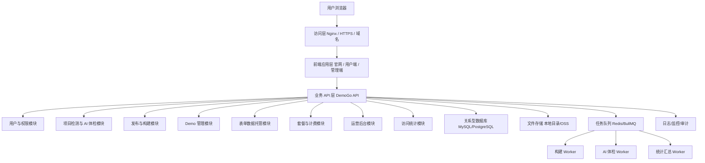
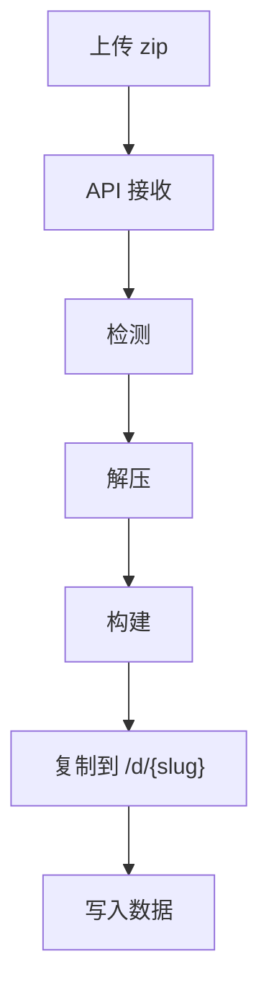
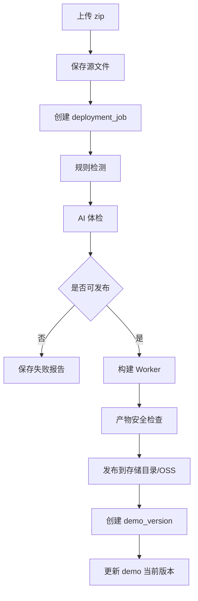
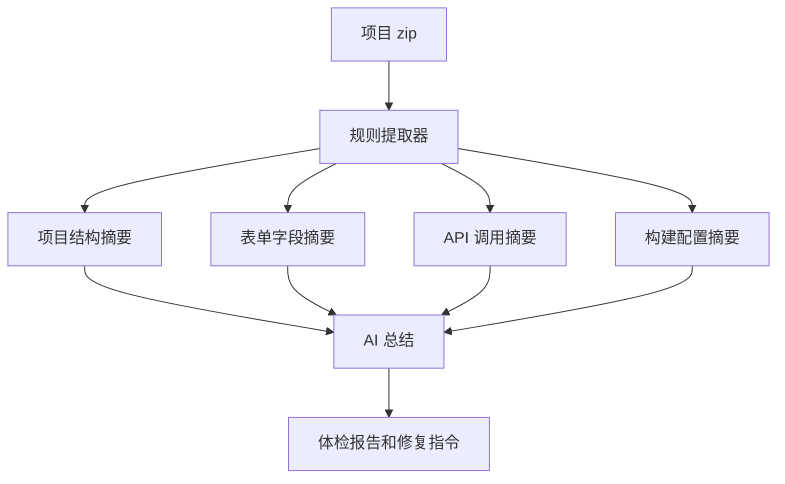
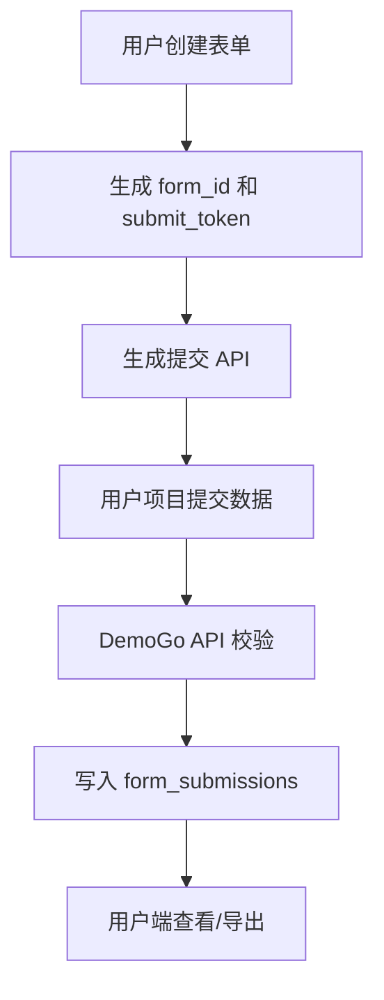

# DemoGo 技术架构

更新时间：2026-05-11

## 1. 架构原则

DemoGo 需要符合长期扩展方向，但不能在早期过度工程化。

推荐原则：

> 用微服务的边界思维设计，用模块化单体先落地，等业务量、团队规模和系统压力真正上来后再拆服务。

当前不建议直接做完整微服务，因为会提前引入服务治理、分布式事务、部署编排、日志追踪和运维复杂度。

更合理的阶段架构是：

> 数据库驱动的模块化单体 + 异步任务 Worker + 清晰领域边界 + 未来可拆微服务。

## 2. 目标架构总览



## 3. 当前架构

当前 v0.1.6：

| 层 | 当前实现 |
|---|---|
| 访问层 | Nginx |
| 前端层 | 静态 HTML/CSS/JS |
| API 层 | Node.js + Express |
| 数据层 | JSON 文件 |
| 文件层 | ECS 本地目录 |
| 发布处理 | API 进程内同步处理 |
| 构建处理 | API 进程内执行 `npm run build` |
| 后台 | 静态页面 + 管理 API + Basic Auth |

当前架构能支撑可用 MVP，但不适合作为准商业化版本长期使用。

主要问题：

- 数据没有正式表结构；
- 所有后端逻辑集中在 `server/src/server.js`；
- 构建任务和 API 请求耦合；
- AI 体检能力尚未形成；
- 缺少数据库、备份、迁移、监控和任务队列；
- 后续表单托管、订单、套餐和统计能力难以继续堆在 JSON 上。

## 4. 推荐落地架构

### 4.1 v0.1.x 到 v0.2.x

采用模块化单体：

```text
server/src/
  app.js
  config/
  db/
  modules/
    auth/
    users/
    demos/
    deployments/
    inspections/
    forms/
    plans/
    admin/
    analytics/
    audit/
  services/
    storage/
    build/
    ai/
  workers/
  utils/
```

说明：

- 仍然是一个 Node.js 应用，部署简单；
- 代码按业务模块拆分，避免继续扩大单文件；
- 数据进入数据库；
- 构建、AI 分析、统计逐步放入 Worker；
- Worker 可以先和 API 在同一台服务器运行。

### 4.2 v0.3.x 以后

在真实压力出现后，优先拆出：

1. Build Worker：构建任务资源消耗最大，优先独立；
2. AI Inspection Worker：AI 调用耗时和成本可控，适合异步；
3. Analytics Worker：访问统计可以异步汇总；
4. Form Service：表单提交量上来后可独立优化；
5. Billing Service：正式支付上线后再拆。

## 5. 未来可拆服务边界

| 当前模块 | 未来可拆服务 | 拆分触发条件 |
|---|---|---|
| 用户与权限 | Auth Service | 多端登录、企业账号、权限复杂化 |
| 项目检测与 AI 体检 | AI Inspection Service | AI 调用量增加、需要独立队列和缓存 |
| 发布与构建 | Build/Deploy Service | 构建任务多、资源隔离要求高 |
| Demo 管理 | Demo Service | Demo 数量和状态流转复杂 |
| 表单托管 | Form/Data Service | 表单提交量和查询量增长 |
| 访问统计 | Analytics Service | 真实流量统计和趋势分析复杂化 |
| 套餐计费 | Billing Service | 接入支付、发票、退款、订单 |
| 运营后台 | Admin Service | 管理端权限和流程复杂化 |

## 6. 数据库选择

DemoGo 需要从 JSON 文件升级到关系型数据库。

优先建议：

| 选择 | 适用情况 |
|---|---|
| MySQL 8 | 当前服务器已有 MySQL，作为 DemoGo v0.1.7 起的主数据库 |
| PostgreSQL | 长期可选方案，当前不优先迁移 |
| SQLite | 没有现成数据库时的轻量过渡方案，当前不采用 |

当前已明确使用 MySQL。后续架构、迁移脚本和部署文档都应以 MySQL 为主。

数据库迁移原则：

1. 先定义正式表结构；
2. 写 JSON 到数据库的迁移脚本；
3. 迁移前备份 JSON；
4. 迁移后做数据校验；
5. 短期保留 JSON 只作为备份，不再作为主数据源；
6. 所有新功能只写数据库。

## 7. 发布与构建架构

当前发布流程：



目标发布流程：



短期可以同步执行，但数据模型和代码边界应按任务模式设计。

## 8. AI 体检架构

AI 体检不直接读取和上传完整用户代码给大模型，而是先做规则提取。



好处：

- 成本低；
- 稳定性更好；
- 降低敏感代码暴露风险；
- 结果可结构化保存；
- 后续可以缓存和复用。

AI 体检结果应写入 `project_inspections` 和 `ai_reports`。

## 9. 表单托管架构

表单托管采用标准 API，不自动接管用户任意后端。



标准提交接口示例：

```text
POST /api/forms/{formId}/submit
```

安全要求：

- 每个表单有提交凭证或来源限制；
- 限制提交频率；
- 限制字段数量和长度；
- 记录 IP 和 User-Agent；
- 支持管理员冻结异常表单；
- 敏感个人信息要有隐私提示和导出权限控制。

## 10. 文件存储架构

短期：

```text
/var/lib/demogo/uploads
/var/www/demogo-preview/d/{slug}
```

中期：

- 上传源文件定期清理或归档；
- Demo 发布产物定期备份；
- 重要文件同步到 OSS；
- Nginx 继续提供访问。

长期：

- 上传包存 OSS；
- 构建产物存 OSS；
- CDN 加速 Demo 访问；
- ECS 只运行 API 和 Worker；
- 通过存储服务抽象屏蔽底层变化。

## 11. 安全与合规架构

| 类型 | 要求 |
|---|---|
| 上传安全 | zip 类型、大小、文件数、解压路径、敏感文件、可执行文件限制 |
| 构建安全 | 超时、CPU/内存限制、后续容器隔离 |
| 账号安全 | 密码哈希、Session、管理员权限、后续邮箱验证 |
| 数据安全 | 数据库备份、导出权限、表单数据保护 |
| 内容安全 | 管理员下线、删除、违规处理、举报入口 |
| 审计安全 | 发布、更新、删除、套餐变更等关键操作入审计日志 |
| 访问安全 | HTTPS、域名、基础限流、防刷 |

## 12. 监控与运维

准商业化版本至少需要：

- API 健康检查；
- 数据库备份；
- 发布失败日志；
- 构建任务日志；
- 访问日志；
- 错误日志；
- 磁盘容量监控；
- 管理员操作审计；
- 部署前备份和回滚方案。

后续可接入：

- 阿里云云监控；
- SLS 日志服务；
- 告警通知；
- 灰度部署；
- 自动化备份。

## 13. 架构演进路线

| 阶段 | 架构重点 |
|---|---|
| v0.1.7 | MySQL 数据库地基、数据模型、发布体验、规则体检报告 |
| v0.1.8 | AI 体检报告增强、管理后台套餐调整 |
| v0.2.0 | 表单托管、用户端数据查看、AI 接入指令 |
| v0.2.x | 任务队列、Worker 化、真实访问统计、备份机制 |
| v0.3.x | 构建服务和 AI 体检服务独立化 |
| v0.5+ | 容器化、对象存储、CDN、支付、按压力拆微服务 |

## 14. 当前建议

下一步不要先做完整微服务，也不要继续堆 JSON。

应优先：

1. 明确数据库表结构；
2. 引入数据库作为主数据源；
3. 将现有后端按模块逐步拆分；
4. 先建立规则体检结果模型，大模型总结后置；
5. 为表单托管预留表和 API 边界；
6. 保持部署方式简单，避免过早引入复杂 DevOps。
