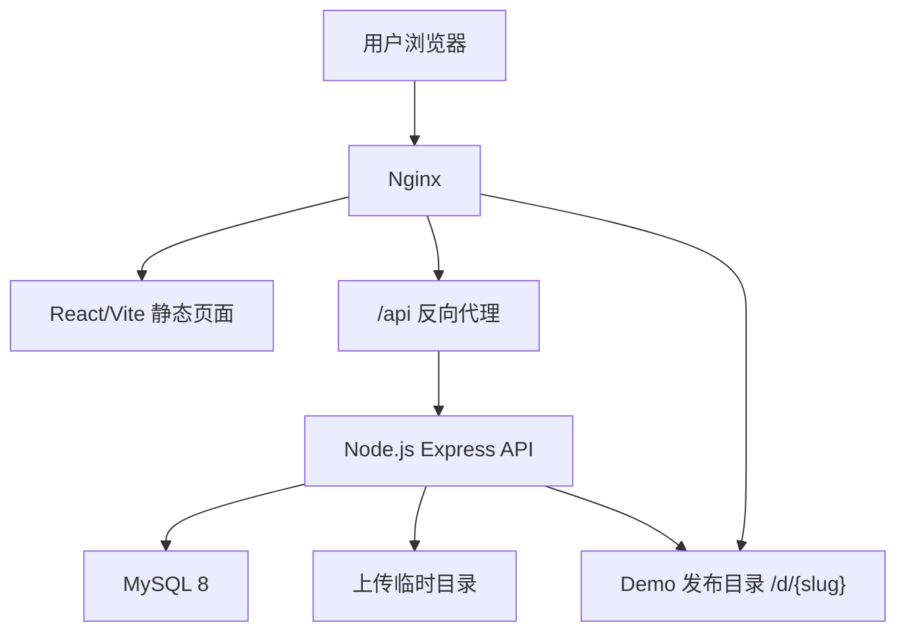

# DemoGo 技术架构设计文档（执行版 v3.0）

更新时间：2026-05-12  
适用阶段：v0.1.13 起  
文档性质：结合当前 v0.1.12 真实架构和长期演进目标后的技术方案

---

## 1. 架构结论

DemoGo 当前技术架构作为 MVP 是合理的：

- 单台阿里云 ECS；
- Nginx 统一入口；
- React + Vite 静态前端；
- Node.js + Express 后端；
- MySQL 8 主数据源；
- 文件系统保存已发布 Demo；
- systemd 管理后端服务；
- Nginx Basic Auth 保护管理后台。

当前不建议直接切换到 Next.js、Redis、PM2 多应用托管、Kubernetes 或完整微服务。

原因：

- 当前用户量和复杂度还不需要；
- 运维成本会显著上升；
- 产品体验问题比底层架构问题更紧急；
- DemoGo 还在试运营验证阶段，架构应渐进演进。

建议路线：

> 单体可维护架构 → 模块化单体 → 异步任务和事件流 → 独立部署引擎 → 对象存储/队列 → 多机部署 → 容器化/集群化。

---

## 2. 当前线上架构



### 2.1 当前目录

本地项目：

```text
demogo/
├── web/                 # React + Vite + TypeScript 前端
├── server/              # Express 后端
├── scripts/             # 部署、回滚、上传脚本
├── dist/                # 打包产物
├── assets/              # 静态资源
└── docs/*.md            # 项目文档
```

服务器目录：

```text
/opt/demogo/server/              # 后端服务
/var/www/demogo-preview/         # 前端静态页面
/var/www/demogo-preview/d/       # 用户 Demo 发布目录
/var/lib/demogo/data/            # JSON 迁移备份/辅助数据
/var/lib/demogo/uploads/         # 上传临时目录
/var/lib/demogo/backups/         # 部署前备份
/root/demogo-db.env              # MySQL 环境变量
```

---

## 3. 当前技术栈

| 层级 | 当前实现 | 说明 |
|---|---|---|
| 前端 | React + Vite + TypeScript | v0.1.12 已完成迁移 |
| 样式 | 原生 CSS | 当前足够，后续可引入设计系统但不急 |
| 后端 | Node.js + Express | 单体 API |
| 数据库 | MySQL 8 | 主数据源 |
| 文件存储 | 本地文件系统 | 发布文件保存在服务器目录 |
| Web 入口 | Nginx | 静态托管、API 代理、管理后台 Basic Auth |
| 进程管理 | systemd | 管理 demogo-server |
| 部署脚本 | Shell + PowerShell | 当前满足单机部署 |

暂不引入：

- Next.js；
- Redis；
- PM2 托管用户应用；
- Docker 运行用户应用；
- Kubernetes；
- 微服务拆分。

---

## 4. 当前数据库结构

v0.1.12 当前有 9 张核心表：

| 表名 | 作用 |
|---|---|
| `users` | 用户账号 |
| `sessions` | 登录会话 |
| `plans` | 套餐配置 |
| `demos` | Demo 主表 |
| `demo_versions` | Demo 版本 |
| `project_inspections` | 项目检测记录 |
| `audit_logs` | 操作日志 |
| `feedback` | 用户反馈 |
| `plan_upgrade_requests` | 套餐升级申请 |

### 4.1 当前数据模型判断

当前表结构对 MVP 是够用的，但未来需要逐步从“Demo 表”演进为更清晰的“Project + Deployment”模型。

短期不建议立即重命名 `demos` 为 `projects`，因为：

- 线上已有数据；
- 当前 API 和前端都依赖 Demo 概念；
- 直接大迁移风险高；
- 产品上先叫“项目”，技术上可以继续用 `demos` 承载。

建议：

```text
产品语义：项目 / Demo 项目
当前数据库：继续使用 demos
未来数据库：逐步演进到 projects + deployments
```

---

## 5. v0.1.13 建议新增/强化的数据结构

### 5.1 deployment_events

建议新增，优先级 P0。

目的：

- 支撑发布过程页；
- 支撑项目详情的部署记录；
- 记录每次发布的关键步骤和失败原因；
- 为后续真实日志流打基础。

建议字段：

| 字段 | 含义 |
|---|---|
| `id` | 事件 ID |
| `demo_id` | 关联 Demo |
| `user_id` | 用户 ID |
| `deployment_id` | 后续预留，当前可为空 |
| `event_type` | receive / extract / inspect / build / publish / success / failed |
| `status` | pending / running / success / failed / skipped |
| `message` | 面向用户的说明 |
| `detail_json` | 技术细节 |
| `created_at` | 创建时间 |

### 5.2 uploads

建议后置，优先级 P1。

当前上传是同步流程，文件上传后立即检测/发布，不一定要单独建表。  
如果后续要支持断点、异步部署、失败重试，再新增 `uploads`。

### 5.3 invitations

建议后置，优先级 P2。

邀请系统有增长价值，但当前不是技术优先级。后续做时再建：

- `invitations`
- `invite_rewards`
- `invite_events`

### 5.4 admins

建议后置，优先级 P2。

当前管理后台由 Nginx Basic Auth 保护，试运营阶段够用。  
未来需要多管理员、权限分级、操作归因时，再新增 `admins` 表。

---

## 6. 后端架构建议

当前 `server/src/server.js` 较大，后续应逐步拆分为模块化单体，而不是马上拆微服务。

建议目标结构：

```text
server/src/
├── server.js                 # 入口，只做 app 初始化和路由挂载
├── config.js
├── db/
│   ├── mysql.js
│   ├── mysql-store.js
│   └── schema.sql
├── routes/
│   ├── auth-routes.js
│   ├── demo-routes.js
│   ├── deploy-routes.js
│   ├── feedback-routes.js
│   ├── plan-request-routes.js
│   └── admin-routes.js
├── services/
│   ├── auth-service.js
│   ├── demo-service.js
│   ├── inspection-service.js
│   ├── deployment-service.js
│   ├── quota-service.js
│   ├── feedback-service.js
│   └── plan-request-service.js
├── lib/
│   ├── archive.js            # zip/tar.gz 解压与安全校验
│   ├── slug.js
│   └── errors.js
└── tests/
    └── smoke-test.js
```

拆分原则：

- 每个版本只拆一小块；
- 不为了“架构好看”大规模重构；
- 先保证发布流程稳定；
- 所有拆分必须有 smoke test 覆盖。

---

## 7. 上传与解压架构

### 7.1 当前状态

当前只支持 `.zip`，使用 zip 解压逻辑。

### 7.2 v0.1.13 建议支持

新增：

- `.tar.gz`
- `.tgz`

### 7.3 安全要求

无论 zip 还是 tar.gz，都必须统一进入安全解压流程：

1. 校验压缩包格式；
2. 禁止路径穿越，例如 `../`;
3. 禁止绝对路径；
4. 禁止软链接和硬链接；
5. 限制文件数量；
6. 限制解压后总大小；
7. 阻止敏感文件；
8. 忽略无关目录；
9. 记录被忽略和被阻止的文件；
10. 解压失败返回人话提示。

阻止文件示例：

```text
.env
.env.local
*.pem
*.key
*.p12
*.pfx
*.exe
*.dll
*.sh
*.bat
*.cmd
*.ps1
```

忽略目录示例：

```text
.git
node_modules
.next
.nuxt
.vite
coverage
.cache
```

---

## 8. 项目检测与发布流程

### 8.1 当前流程

```text
上传 zip
→ 解压
→ 检测项目
→ 如需要执行 npm run build
→ 复制到 /d/{slug}
→ 写入 demos
→ 返回链接
```

### 8.2 建议流程

```text
创建项目
→ 上传文件
→ 安全解压
→ 生成 deployment_events
→ 项目检测
→ 生成检测报告
→ 构建静态产物
→ 发布静态文件
→ 生成访问链接
→ 写入版本记录
→ 返回发布成功页数据
```

### 8.3 发布状态

建议统一发布状态：

| 状态 | 含义 |
|---|---|
| `queued` | 等待处理 |
| `extracting` | 解压中 |
| `inspecting` | 检测中 |
| `building` | 构建中 |
| `publishing` | 发布中 |
| `success` | 成功 |
| `failed` | 失败 |

当前 v0.1.13 可不做真正异步队列，但状态模型要先设计好。

---

## 9. API 演进建议

当前 API 可以继续使用，但后续建议逐步向资源化 API 靠拢。

### 9.1 当前保留

继续保留：

```text
/api/auth/register
/api/auth/login
/api/auth/logout
/api/me
/api/demos
/api/inspect
/api/deploy
/api/demos/:id/update
/api/demos/:id/offline
/api/demos/:id/restore
/api/demos/:id/delete
/api/deploy-events
/api/feedback
/api/plan-upgrade-requests
/api/admin/*
```

### 9.2 v0.1.13 可新增

```text
GET  /api/demos/:id
GET  /api/demos/:id/deployments
GET  /api/demos/:id/inspection
GET  /api/demos/:id/events
```

### 9.3 后续 v0.2 可演进

```text
GET    /api/projects
POST   /api/projects
GET    /api/projects/:id
POST   /api/projects/:id/deployments
GET    /api/projects/:id/deployments
GET    /api/deployments/:id/events
```

不建议 v0.1.13 直接把所有 `/demos` API 改成 `/projects`，避免破坏现有功能。

---

## 10. 前端架构建议

v0.1.12 已建立 `web/` 工程，v0.1.13 应继续强化，而不是再回到大 HTML 文件。

建议目录：

```text
web/src/
├── api/
├── components/
├── config/
├── pages/
├── styles/
├── types.ts
└── utils/
```

后续可逐步增加：

```text
web/src/
├── layouts/
├── features/
│   ├── projects/
│   ├── deployments/
│   ├── plans/
│   └── admin/
└── hooks/
```

### 10.1 设计系统

v0.1.13 应建立基础 UI 规范：

- 按钮；
- 输入框；
- 上传框；
- 表格；
- 状态标签；
- 弹窗；
- 空状态；
- 错误状态；
- 成功页；
- 详情页布局。

当前不建议马上引入大型 UI 框架。可以先用自定义 CSS 形成统一风格。

---

## 11. 管理后台架构

管理后台当前是同一个 React 前端的 `admin.html`。

短期保留：

- Nginx Basic Auth；
- `/api/admin/*`；
- 单管理员口径。

v0.1.13 优化重点：

- 运营待办；
- 升级申请；
- 用户反馈；
- 高风险 Demo；
- 发布失败；
- 新用户。

后续再考虑：

- `admins` 表；
- 管理员登录；
- 权限角色；
- 操作归因；
- 多管理员协作。

---

## 12. 安全架构

### 12.1 当前必须坚持

- 不托管用户后端进程；
- 不执行危险脚本；
- 不发布敏感文件；
- 限制上传大小；
- 限制解压文件数量；
- 限制解压后总大小；
- 管理后台 Basic Auth；
- 所有用户操作写入 audit logs；
- 上传临时文件及时清理。

### 12.2 tar.gz 新增风险

支持 tar.gz 时必须处理：

- 符号链接；
- 硬链接；
- 文件权限；
- 路径穿越；
- 超大解压；
- 特殊文件；
- 嵌套压缩包。

### 12.3 暂不建议

当前阶段不建议托管 Node.js 应用，原因：

- 用户代码可执行风险高；
- 资源隔离复杂；
- 需要进程管理；
- 需要端口分配；
- 需要日志、限流、沙箱；
- 需要更多运维能力。

---

## 13. 运维与备份

当前部署方式继续保留：

- 本地打包；
- scp 上传；
- 服务器执行部署脚本；
- 部署前备份；
- systemd 重启；
- 健康检查；
- 可回滚。

v0.1.13 建议补充：

- MySQL 定时备份脚本；
- Demo 文件目录备份策略；
- 服务器磁盘使用检查；
- Nginx 日志轮转；
- 后端错误日志检查命令；
- 发布失败排查手册。

不建议当前引入复杂 CI/CD。等试运营稳定后，再考虑 GitHub Actions。

---

## 14. 分阶段演进路线

### 14.1 当前阶段：v0.1.x

目标：试运营可用。

技术路线：

- 单机；
- MySQL；
- React/Vite；
- Express 单体；
- 本地文件系统；
- 手动部署脚本。

### 14.2 v0.2

目标：数据回收和商业验证。

可能新增：

- 表单托管；
- 真实访问统计；
- 支付/订单；
- 邮件通知；
- 更完整的项目详情；
- 更完善的部署事件流。

### 14.3 v0.3

目标：稳定运营。

可能新增：

- 对象存储；
- 异步任务队列；
- Redis；
- 独立部署服务；
- CI/CD；
- 自定义域名；
- HTTPS 正式域名。

### 14.4 v1.0 后

目标：可规模化平台。

可能新增：

- 多机部署；
- 独立构建节点；
- 容器沙箱；
- 更完整的多租户隔离；
- 插件/API；
- AI 编程工具集成。

---

## 15. 对 v2 技术文档的取舍

### 15.1 吸收

- 单机到集群的渐进演进；
- 项目/部署/上传/邀请的领域拆分；
- 发布过程日志；
- 运营指标；
- 安全隔离意识；
- 备份和监控意识。

### 15.2 调整

- Next.js 改为继续使用 React + Vite；
- Redis 后置；
- PM2 用户应用托管后置；
- `projects` 概念先产品化，数据库暂不大迁移；
- 邀请系统后置；
- `/api/v1` 后置，不立即重构现有 API；
- K8s 作为远期目标，不进入当前计划。

### 15.3 不采纳

- MVP 支持 Node.js 应用；
- MVP 支持 Next.js SSR；
- MVP 使用 Redis；
- MVP 每项目 Linux 用户隔离；
- MVP 使用 cgroups；
- MVP 直接搭多服务 monorepo；
- MVP 做完整邀请码防作弊。

---

## 16. v0.1.13 技术验收标准

v0.1.13 技术完成后，应满足：

1. `.zip / .tar.gz / .tgz` 均可上传检测；
2. 非法压缩包有清晰错误提示；
3. 路径穿越、软链接、敏感文件被阻止；
4. 发布过程至少能生成结构化步骤；
5. 项目详情 API 能返回基础信息、发布记录、检测结果；
6. 前端构建通过；
7. 后端语法检查通过；
8. smoke test 通过；
9. 打包脚本生成完整部署包；
10. 部署脚本可回滚；
11. 不破坏 v0.1.12 已上线功能。

