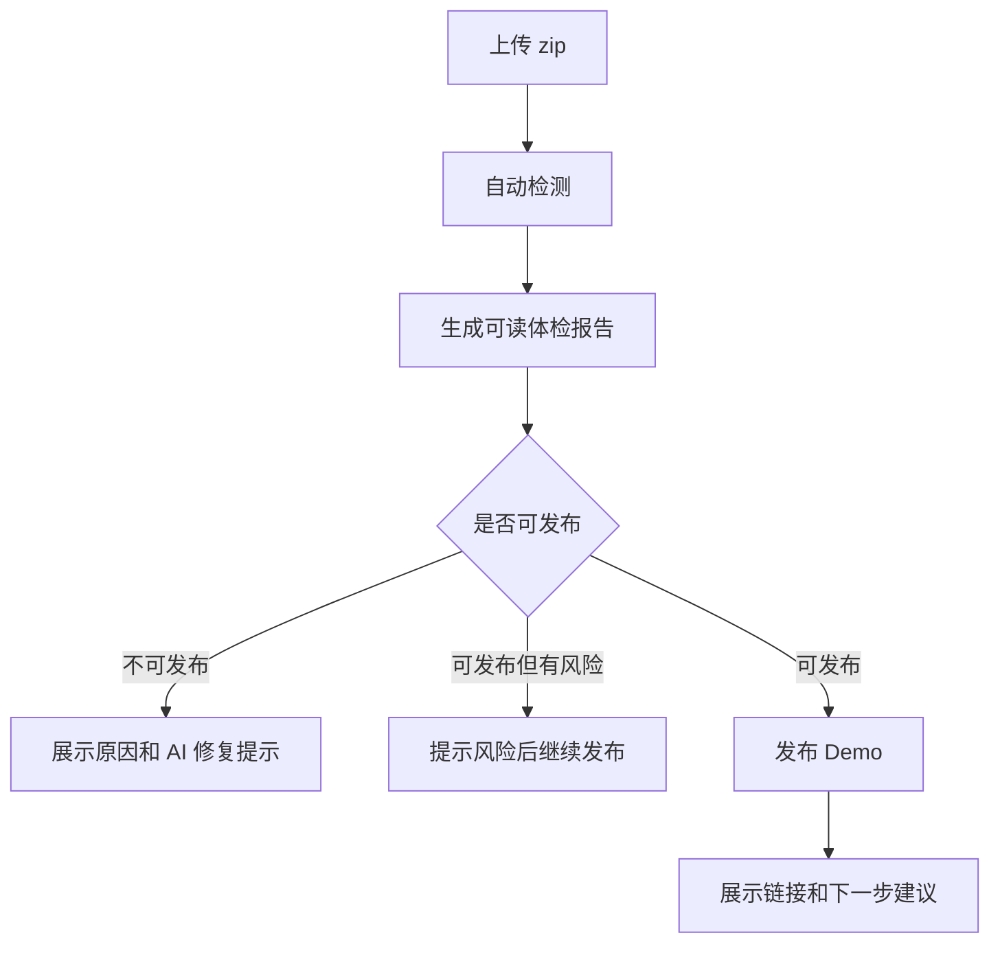
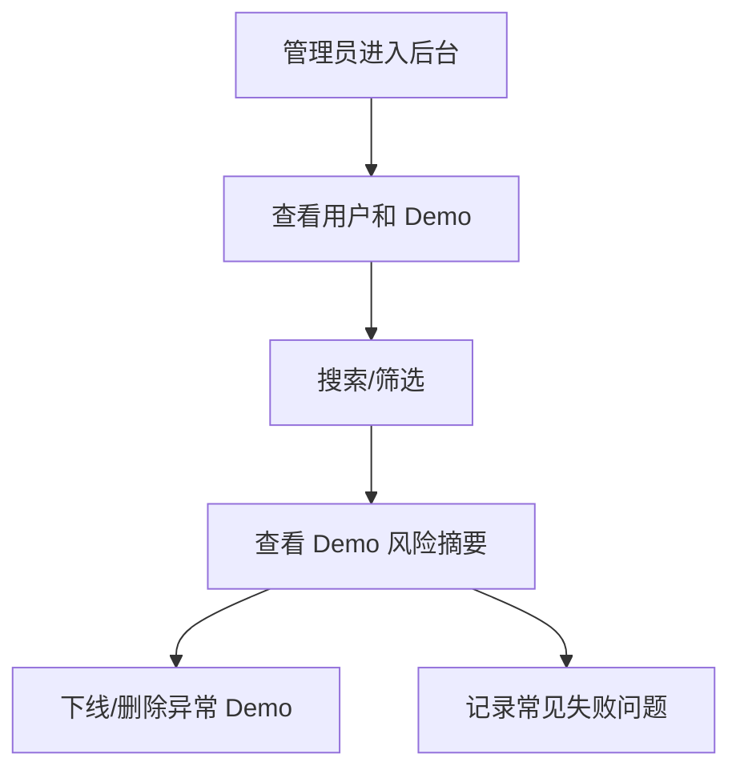

# DemoGo v0.1.8 方案：真实试用准备版

更新时间：2026-05-11

## 1. 版本定位

v0.1.8 的目标不是做大功能，而是把 v0.1.7 的“可用 MVP”打磨成可以给第一批真实用户试用的版本。

一句话：

> 让用户更容易看懂、用起来更稳，管理员更容易发现问题和运营试用。

## 2. 当前基线

v0.1.7 已上线并通过线上验收：

- 后端版本：`0.1.7`
- MySQL 已作为主数据源；
- JSON 到 MySQL 迁移成功；
- 用户注册、登录、上传、检测、发布、管理 Demo 可用；
- 规则体检报告可识别报名表单和本地 API 风险；
- 带报名表单的测试包已通过线上测试。

## 3. v0.1.8 要解决的问题

### 3.1 用户侧问题

当前用户可以发布 Demo，但非技术用户仍可能不清楚：

- 为什么项目能发布但表单数据不能保存；
- 本地 `/api/...` 是什么风险；
- 发布失败后该怎么让 AI 编程工具修；
- DemoGo 当前到底支持什么、不支持什么；
- 出问题后怎么反馈给 DemoGo。

### 3.2 管理侧问题

当前管理后台可以看用户和 Demo，但运营试用用户还不够方便：

- 用户和 Demo 多起来后不好搜索；
- 不方便按状态筛选 Demo；
- 不方便查看某个 Demo 的检测报告；
- 不方便快速判断最近失败和风险类型；
- 还没有明确的用户反馈入口。

### 3.3 运维侧问题

v0.1.7 部署中暴露出一个运维问题：

- Windows 生成的 zip 在 Linux `unzip` 时会有 warning；
- 部署脚本使用 `set -e`，会因为 warning 中断；
- 线上已临时修复，源码脚本需要正式修复。

## 4. 版本范围

### P0：部署脚本稳定性修复

必须做。

- 修复前端 zip 和后端 zip 解压 warning 导致部署脚本中断的问题；
- 部署脚本健康检查增加短等待和重试；
- 验证脚本输出更清楚，明确当前版本、数据库配置、服务状态；
- 保留自动备份和回滚能力。

业务意义：

> 避免每次发版都靠人工临时修脚本，降低上线风险。

### P0：用户端检测报告可读性优化

把当前“规则体检”改成更像非技术用户能读懂的报告。

建议展示为：

- 发布结论：可以发布 / 可以发布但部分功能不可用 / 暂不能发布；
- 项目类型：活动报名页、预约页、宣传页、普通前端项目；
- 发现的能力：页面、表单、API、构建配置；
- 风险说明：例如“报名数据不会自动保存”；
- 下一步建议：重新打包、补 build 命令、让 AI 工具修改接口；
- 一键复制给 AI 编程工具的提示词。

业务意义：

> DemoGo 的 AI 感不来自聊天，而来自“看懂项目并给出可执行建议”。

### P0：上传失败和发布失败提示优化

失败提示要从“技术错误”变成“用户可行动建议”。

重点覆盖：

- 没有 `index.html`；
- 有 `package.json` 但没有 build 命令；
- build 失败；
- 包含 `.env` 或密钥文件；
- 文件太多或体积太大；
- 调用本地 API；
- 当前套餐在线 Demo 数量已满；
- 发布过于频繁。

业务意义：

> 减少用户卡住后直接放弃，提高真实试用成功率。

### P0：管理后台搜索与筛选

管理后台增强为早期运营工具。

建议能力：

- 用户搜索：邮箱关键词；
- Demo 搜索：名称、slug、用户邮箱；
- Demo 状态筛选：已发布、已下线、已过期、已删除、失败；
- 展示检测风险摘要：表单、本地 API、无 build 命令、敏感文件；
- 管理员能查看某个 Demo 的检测报告摘要。

业务意义：

> 支撑第一批真实用户试用，不需要翻大量列表。

### P1：用户反馈入口

在用户端增加一个轻量反馈入口。

第一版不做复杂工单系统，可以先做：

- 反馈按钮；
- 跳转到固定联系方式或表单；
- 或保存到 MySQL `feedback` 表；
- 记录用户、Demo、问题类型、描述、时间。

建议优先做入库版，因为后续可统计。

业务意义：

> 小范围试用最重要的是收集失败场景和用户真实疑问。

### P1：支持边界说明强化

在用户端上传区和官网增加更清楚的支持边界：

支持：

- 静态 HTML；
- `dist` / `build`；
- 常见前端源码项目；
- 活动报名页、预约页、宣传页、简单展示型 Demo。

暂不支持：

- 完整后端服务；
- 自带数据库；
- Docker；
- 真实支付；
- 任意自定义 API 自动托管；
- 复杂管理后台业务系统。

业务意义：

> 降低不匹配用户的预期，减少无效测试。

## 5. 不纳入 v0.1.8

为避免范围失控，v0.1.8 不做：

- 正式表单托管；
- 大模型 AI 体检；
- 在线支付；
- 订单系统；
- 管理后台套餐调整；
- Docker/后端应用托管；
- 复杂多角色权限；
- 完整前端框架重构；
- 微服务拆分。

## 6. 产品流程变化

### 6.1 用户上传检测流程



### 6.2 管理后台运营流程



## 7. 技术实现建议

### 7.1 后端

继续保持模块化单体，不做大重构。

建议新增或调整：

- `feedback` 表；
- 管理后台 API 支持搜索和筛选参数；
- Demo 返回检测报告摘要；
- 错误提示函数统一整理；
- 部署脚本兼容 unzip warning；
- 健康检查增加重试。

### 7.2 前端

保持静态 HTML/CSS/JS，不引入前端框架。

建议修改：

- `app.html` 检测报告展示；
- `app.html` 反馈入口；
- `admin.html` 搜索、筛选、检测摘要；
- `index.html` 支持边界说明；
- 必要时补充轻量样式。

### 7.3 数据库

可新增一张表：

```text
feedback
```

建议字段：

| 字段 | 含义 |
|---|---|
| id | 反馈 ID |
| user_id | 用户 ID |
| user_email | 用户邮箱 |
| demo_id | 关联 Demo，可为空 |
| type | 问题类型 |
| message | 反馈内容 |
| status | 状态：open/resolved/ignored |
| created_at | 创建时间 |
| updated_at | 更新时间 |

## 8. 验收标准

v0.1.8 完成后必须满足：

- 部署脚本不再因 zip warning 中断；
- 线上健康检查稳定返回 `0.1.8`；
- 用户能看懂检测报告的核心结论；
- 发布失败时能看到明确原因和下一步建议；
- 管理员能搜索用户和 Demo；
- 管理员能按状态筛选 Demo；
- 管理员能看到 Demo 风险摘要；
- 用户能提交反馈；
- v0.1.7 已有注册、登录、发布、下线、恢复、删除能力不被破坏。

## 9. 推荐开发顺序

1. 修部署脚本和打包脚本；
2. 优化检测报告文案和展示结构；
3. 优化错误提示；
4. 管理后台搜索和筛选；
5. 反馈入口和 feedback 表；
6. 支持边界说明；
7. 自审、自测、打包、部署。

## 10. 版本之后

v0.1.8 之后，如果第一批用户试用顺利，建议进入：

- v0.1.9：管理后台套餐调整和运营能力；
- v0.2.0：表单托管和数据回收；
- v0.2.x：真实访问统计、数据库备份、Worker 化。
