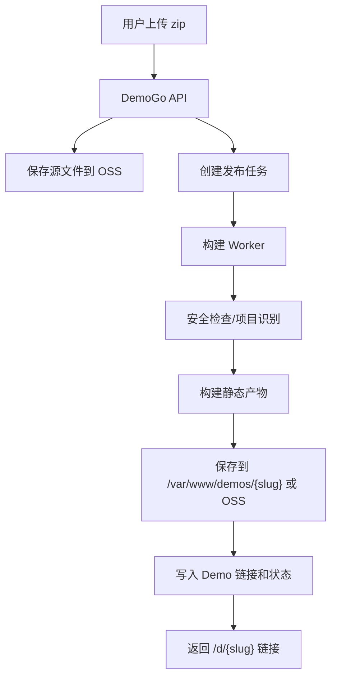

# DemoGo 阿里云 MVP 架构

## 架构目标

DemoGo 自身分为三端：

- 官网首页：获客、解释产品、引导注册和上传。
- 用户端：登录、上传 Demo、查看链接、套餐余量、订单记录。
- 管理后台：查看用户、订单、Demo、失败任务、风控队列和运营数据。

用户 Demo 运行层分为两类：

- v0.1：静态 Demo，构建后以文件托管方式运行。
- v0.2+：动态 Demo，再考虑容器化运行。

核心原则：

- DemoGo 平台自身要系统化。
- 用户 Demo 运行层要分级，不要一开始全部容器化。
- 静态 Demo 构建时用容器隔离，运行时用静态托管。

## MVP 访问结构

备案前：

```text
http://8.155.150.162/             官网
http://8.155.150.162/app.html     用户控制台原型
http://8.155.150.162/admin.html   管理后台原型
http://8.155.150.162/d/{slug}     用户 Demo 链接
```

备案后第一阶段：

```text
https://demogo.cn/                官网
https://demogo.cn/app             用户控制台
https://demogo.cn/admin           管理后台
https://demogo.cn/d/{slug}        用户 Demo 链接
```

泛域名稳定后：

```text
https://app.demogo.cn             用户控制台
https://admin.demogo.cn           管理后台
https://{slug}.demogo.cn          用户 Demo 链接
```

## 阿里云资源映射

| 模块 | MVP 资源 | 后续升级 |
|---|---|---|
| 官网/用户端/后台前端 | ECS + Nginx 静态文件 | OSS + CDN 或前端独立部署 |
| DemoGo API | ECS 上 Node/Python 服务 | 多实例 + 负载均衡 |
| 数据库 | RDS MySQL/PostgreSQL，或早期 ECS 自建 | RDS 高可用 |
| 上传 zip 存储 | OSS | OSS 生命周期管理 |
| 构建产物存储 | ECS 目录或 OSS | OSS + CDN |
| 构建 Worker | ECS + Docker | ACK/SAE/弹性任务 |
| Demo 访问入口 | Nginx 路由 `/d/{slug}` | 泛域名 + ALB/Nginx |
| 日志 | 本地文件 + 数据库 | SLS 日志服务 |
| 监控 | ECS 基础监控 | 云监控 + 告警 |
| 支付 | 早期人工开通 | 微信/支付宝自动支付 |
| 权限 | 管理后台登录 | RBAC + IP 白名单 |

## v0.1 静态 Demo 发布流程



## Nginx 路由设计

MVP 阶段：

```text
/              官网
/app           用户端
/admin         管理后台
/d/{slug}      用户 Demo
/api/*         DemoGo 后端 API
```

静态 Demo 本地目录：

```text
/var/www/demogo-site
/var/www/demogo-app
/var/www/demogo-admin
/var/www/demos/{slug}
```

如果先保持单文件原型，也可以：

```text
/var/www/demogo-preview/index.html
/var/www/demogo-preview/app.html
/var/www/demogo-preview/admin.html
/var/www/demogo-preview/d/{slug}/index.html
```

## 数据库核心表

### users

- id
- phone
- email
- plan
- status
- created_at

### projects

- id
- user_id
- name
- slug
- status
- public_url
- source_zip_path
- output_path
- expires_at
- created_at
- updated_at

### deployments

- id
- project_id
- status
- detected_type
- file_size
- log_path
- error_message
- started_at
- finished_at

### plans

- id
- code
- name
- max_online_demos
- monthly_deploy_limit
- max_zip_size_mb
- demo_retention_days

### orders

- id
- user_id
- plan_code
- amount
- status
- payment_method
- paid_at
- created_at

### audit_logs

- id
- actor_type
- actor_id
- action
- target_type
- target_id
- metadata
- created_at

## 安全与风控

上传限制：

- 仅允许 `.zip`。
- 单包限制 50MB 起步。
- 解压后限制文件数量和总大小。
- 禁止嵌套压缩包绕过限制。
- 拒绝 `.env`、`.git`、`*.key`、`*.pem`、`id_rsa`。
- 拒绝明显二进制可执行文件。

构建限制：

- Docker 隔离执行。
- 限制 CPU、内存、磁盘、构建时长。
- 构建失败保留日志。
- 免费用户发布失败不扣次数，成功发布才扣。

访问限制：

- 免费 Demo 有有效期。
- 免费 Demo 有访问量限制。
- 支持管理后台一键下线。
- 支持举报邮箱和人工处理。

管理后台限制：

- 不在官网公开管理后台入口。
- 必须登录。
- 建议加 IP 白名单。
- 关键操作写入审计日志。

## 阶段路线

### 阶段 0：当前原型

- 官网 `index.html`
- 用户端 `app.html`
- 管理后台 `admin.html`
- 协议、隐私、内容规范
- 公网 IP 预览

### 阶段 1：可用 MVP

- 用户登录
- 上传 zip
- 构建静态 Demo
- 返回 `/d/{slug}` 链接
- Demo 列表
- 到期自动下线
- 管理后台查看和下线
- 人工开通套餐

### 阶段 2：商业闭环

- 支付订单
- 套餐自动生效
- 访问统计
- 邮件/短信通知
- OSS 生命周期清理
- 构建日志查看

### 阶段 3：AI 工具接入

- DemoGo CLI
- MCP Server
- Codex Skill
- Cursor / Claude Code MCP
- OpenAPI 插件

### 阶段 4：动态 Demo

- 容器化运行 Node/Python 后端
- 镜像仓库 ACR
- ACK/SAE/弹性容器
- 按资源或按天收费
