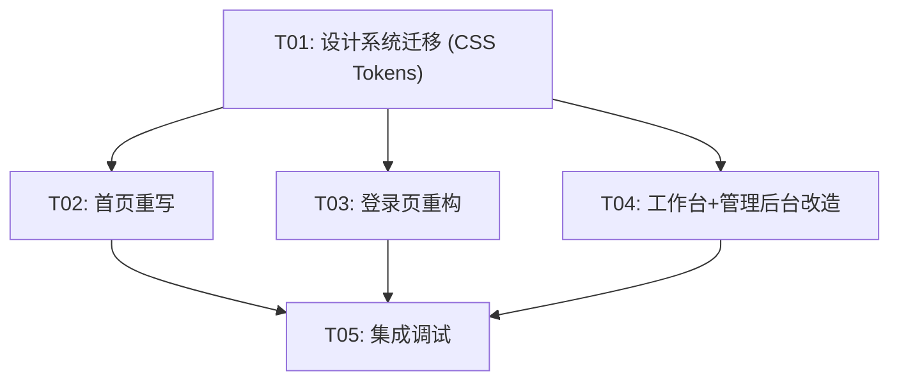

# DemoGo 前端设计修复计划

> **基于**: 设计规格文档 `deliverables/DEMOGO-DESIGN-SPEC.md` + 5个 HTML 设计稿  
> **当前代码**: `web/` 目录 (青色调 #06B6D4 主题，已 restore 到改版前稳定状态)  
> **目标**: 翠绿色 #22C55E iOS 极简风，完全对齐设计稿  
> **原则**: 文案保留现有内容，只改结构和样式

---

## 一、设计系统变更对比

### 1.1 色彩系统 — 从青色(#06B6D4) → 翠绿(#22C55E)

| Token | 当前值 (青色) | 目标值 (翠绿) | 文件 |
|-------|-------------|-------------|------|
| `--accent` | `var(--cyan-500)` / `#06B6D4` | `#22C55E` | `design-tokens.css` |
| `--accent-hover` | `#0891B2` / `--cyan-600` | `#16A34A` | 新增 |
| `--accent-subtle` | `rgba(6,182,212,.08)` / `var(--cyan-50)` | `rgba(34,197,94,.08)` | 新增 |
| `--accent-border` | `rgba(6,182,212,.2)` / `var(--cyan-200)` | `rgba(34,197,94,.2)` | 新增 |
| `--text-primary` | `var(--gray-900)` / `#1C1917` | `#1D1D1F` | 保留相似 |
| `--text-secondary` | `var(--gray-600)` / `#57534E` | `#6E6E73` | 更新值 |
| `--text-tertiary` | `var(--gray-500)` / `#78716C` | `#86868B` | 更新值 |
| `--text-quaternary` | (无) | `#A1A1A6` | 新增 |
| `--border` | `var(--gray-300)` / `#D6D3D1` | `#D2D2D7` | 更新值 |
| `--border-light` | `var(--gray-200)` / `#E7E5E4` | `#E8E8ED` | 保留相似 |
| `--bg` | `var(--gray-50)` / `#FAFAF9` | `#FFFFFF` | 更新 |
| `--bg-section` | `var(--gray-100)` / `#F5F5F4` | `#F5F5F7` | 更新 |

### 1.2 圆角系统

| Token | 当前 | 目标 |
|-------|------|------|
| `--radius-md` | `var(--r-2xl)` / `20px` | `18px` |
| `--radius-pill` | `var(--r-full)` / `9999px` | `100px` |
| 图标容器 | `var(--r-lg)` / `12px` | `12px` |
| Mockup 圆角 | `20px` | `20px` |

### 1.3 阴影系统

| Token | 当前 | 目标 |
|-------|------|------|
| `--shadow-sm` | `0 1px 3px rgba(0,0,0,.05)`... | `0 1px 3px rgba(0,0,0,.04)` |
| `--shadow-md` | `0 4px 14px rgba(0,0,0,.06)`... | `0 4px 12px rgba(0,0,0,.06)` |
| `--shadow-lg` | `0 8px 28px rgba(0,0,0,.08)`... | `0 8px 24px rgba(0,0,0,.08)` |
| `--shadow-green` | (使用 `--shadow-cyan`) | `0 4px 20px rgba(34,197,94,.1)` |

### 1.4 间距与字体

| Token | 当前 | 目标 |
|-------|------|------|
| 区块间距 | `var(--sp-32)` / `128px` | `120px`(桌面)/`80px`(移动) |
| 导航高度 | `64px` | `48px` |
| 导航内边距 | `0 var(--sp-6)` | `0 40px` |
| Hero 标题 | `clamp(56px, 8.5vw, 88px)` | `clamp(34px, 5vw, 56px)` |
| 章节标题 | `clamp(36px, 5vw, 56px)` | `clamp(28px, 4vw, 44px)` |
| 字体栈 | `"Inter", -apple-system...` | `-apple-system, BlinkMacSystemFont, 'SF Pro Display'...` |

### 1.5 过渡动画

| Token | 当前 | 目标 |
|-------|------|------|
| ease 函数 | `cubic-bezier(0.4,0,0.2,1)` | `cubic-bezier(.25,0,.15,1)` (Apple 缓动) |

---

## 二、页面级差距分析

### 2.1 首页 (`HomePage.tsx`)

#### 结构差异 (当前 → 目标)

```
当前结构:                              目标结构 (demogo-landing-ios.html):
┌─ site-nav (64px)                    ┌─ nav (48px, sticky)
│  BrandLogo(svg) + 登录/免费开始       │  ◆DemoGo + 功能介绍/使用流程/免费使用(cta)
├─ hero (min-height 100vh)            ├─ hero (padding 100px 24px 80px)
│  hero-badge(cyan, "免费内测中")       │  hero-badge(green, "免费内测中" + 绿点)
│  h1 "用 AI 做出来的产品/做完就能发"    │  h1 "做完作品，直接扔个链接" + accent-text
│  p "不用买域名..."                    │  p "Cursor 里写完项目..."
│  hero-cta (Sparkles + "在AI工具...")  │  hero-ctas: [免费开始使用] [看看怎么玩 →]
│  hero-trust "3,000+ 产品已上线"      │  hero-visual: macOS 风格 mockup
│  hero-terminal (聊天式 mockup)       │   (16/10 窗口, 红黄绿圆点, 两张卡片+箭头)
│  hero-scroll-hint                    │
├─ home-compare (对比卡片, 3列)         ├─ section-alt: features section
│  "不用懂技术也能把产品发出去"          │  sec-label "核心功能" + h2 + p
│  comparisonCards                     │  feat-grid (3列 feat-card)
│                                      │   ⚡秒上线 / 🔗闭眼分享 / 🛠️通吃所有工具
├─ home-demo (AI 发布演示)             ├─ (无 — 设计稿中没有此 section)
│  "发布就是一句话的事"                  │
├─ home-steps (三步带 inner voice)      ├─ steps section (白底)
│  "三步，就三步"                       │  sec-label "就三步" + h2 "比泡面还快"
│  step-item (01/02/03 + 描述)          │  step-grid (3列step-card + step-num 圆形)
│                                      │   ①做出东西 / ②扔进DemoGo / ③丢链接出去
├─ home-trust (信任指标)               ├─ section-alt: metrics section
│  "你不是一个人" + 3,000+ / <3min / 免费 │  sec-label "数据说话"
│                                      │  metric-row (3列, 带竖线分隔, 绿色数字)
│                                      │   500+ / 2,300+ / 97%
├─ home-cta (绿色渐变标题 + 免费发布)    ├─ sec-cta (白底)
│  "把你的产品发出去" + "免费发布"        │  sec-label "还等什么？"
│  "无需信用卡" + 客服信息              │  h2 "你的下个作品，现在就发出去"
│                                      │  CTA 大按钮 + "无需信用卡，随时取消"
└─ home-footer (legal-links 简化版)    └─ footer (完整版)
   BrandLogo + 服务条款/隐私/联系        │  ◆DemoGo + tagline
                                       │  产品(3链接) + 资源(3链接)
                                       │  © 2025 DemoGo... 微博·微信公众号
```

#### 关键 CSS 结构映射

| 设计稿类名 | React JSX 结构 | CSS 变量/值 |
|-----------|---------------|------------|
| `.nav` | `<header className="site-nav">` 改为 `<nav className="nav">` | height:48px, backdrop-filter blur(20px), padding:0 40px |
| `.nav-logo .mark` | `◆DemoGo` 文本，非 SVG | 16px/700, `.mark` 绿色 |
| `.nav-links` | 3 个 `<a>`: 功能介绍/使用流程/免费使用(cta) | gap:32px, font-size:12px |
| `.nav-links a.cta` | 最后一个链接加 `cta` 类 | outline pill, border:1px solid accent-border |
| `.hero` | 当前 hero section 重构 | padding:100px 24px 80px; ::before 绿色光晕 |
| `.hero-badge` | 徽章 + 绿色圆点 `::before` | bg: accent-subtle, pill 圆角 |
| `.hero-visual .mockup` | macOS 风格模拟窗口 | 16/10 aspect-ratio, 20px 圆角 |
| `.mockup-bar .mockup-dot` | 红/黄/绿圆点 | #FF5F57/#FEBC2E/#28C840 |
| `.mockup-card` | 两张内部卡片 + 箭头 | 180×120, 12px 圆角 |
| `.section-alt` | Features + Metrics 使用 | bg: #F5F5F7, ::before 绿色渐变光晕 |
| `.sec-label` | 区块标签 (如 "核心功能") | 12px/600 green, ::after 24px 绿线 |
| `.feat-grid` | 3列网格, gap:20px | grid-template-columns: repeat(3,1fr) |
| `.feat-card` | 功能卡片 | padding:40px 28px, radius-md, hover 绿色边框+上浮 |
| `.feat-icon` | 图标容器 | 44×44, radius:12px, accent-subtle bg |
| `.step-grid` | 3列步骤网格 | gap:20px, margin-top:60px |
| `.step-num` | 圆形步骤数字 | 56×56, green bg, 50%圆, box-shadow green |
| `.metric-row` | 3列数据指标 | border:1px solid border-light, radius-md |
| `.metric + .metric::before` | 列间竖线分隔 | left:0, top:20%, height:60% |
| `.metric-num .num-accent` | 绿色高亮数字 | color: var(--accent) |
| `.sec-cta` | CTA 大区 | text-align:center, btn-pill.primary 大按钮 16px 44px |
| `.footer` | 完整页脚 | bg-section, border-top, flex space-between |
| `.footer-links` | 两列链接 | gap:48px |
| `.footer-bottom` | 底部版权 + 社交 | margin-top:36px, border-top |

#### 文案保留策略
首页现有文案（中文"用 AI 做出来的产品 / 做完就能发出去"等）**保持不变**，但需映射到设计稿的结构中：
- Hero h1: 保留"用 AI 做出来的产品\n做完就能发出去" → 用 h1 + `accent-text` 包装后半句
- Hero p: 保留"不用买域名·不用配服务器·不用学部署" + "一个链接，发给谁都能打开..."
- CTA 按钮文案: 保留"免费开始使用" + "看看怎么玩 →"
- 其余 sections（功能/步骤/指标/CTA）保留现有中文文案

### 2.2 登录页 (`LoginPage.tsx`)

#### 结构差异

```
当前结构:                             目标结构 (demogo-login-ios.html):
┌─ login-page (渐变 bg)               ┌─ body (bg-section #F5F5F7, flex居中)
│  login-shell                        │  .card (max-width:400px, radius-md)
│  ← 返回首页 (btn ghost)               │   .logo: ◆DemoGo (22px green mark)
│  Card(login-card)                    │   .title: "欢迎回来" (22px/700)
│   BrandLogo (SVG)                    │   .sub: "登录后继续管理你的作品" (14px)
│   如果 succeeded → 成功状态           │   .tabs: [登录 active] [免费注册]
│   否则:                              │   form:
│     login-kicker: "欢迎回来"(cyan)     │     .field 邮箱 → input
│     h1: "继续管理你的作品"             │     .field 密码 → input
│     p: "查看你的作品、分享记录..."      │     .btn-block: "进入工作台"(green pill)
│     login-mode-tabs: [登录][免费注册]  │   .footer-text: "还没有账号？免费注册DemoGo"
│     form (email/password/验证码)      │  .legal: © 2025 DemoGo...
│     login-switch: "还没有账号？..."    │
│  login-legal                         │
```

#### 关键 CSS 结构映射

| 设计稿类名 | React JSX 结构 | CSS 值 |
|-----------|---------------|--------|
| `body` (flex centering) | 当前 `.login-page` 重构 | min-height:100vh, flex column, center, bg-section |
| `.card` | 白色卡片容器 | max-width:400px, radius-md, padding:48px 36px 40px |
| `.logo .mark` | `◆DemoGo` 文本 | font-size:20px/700, mark:22px green |
| `.title` | "欢迎回来" | 22px/700, text-align:center |
| `.sub` | 描述文字 | 14px, text-secondary, text-align:center |
| `.tabs` | 登录/注册切换 | flex, bg-section, radius:12px, padding:4px |
| `.tab.active` | 激活的 tab | bg:white, box-shadow, radius:10px |
| `.field` | 表单字段 | flex column, gap:4px |
| `.btn-block` | 全宽按钮 | width:100%, radius-pill, bg:accent |
| `.footer-text` | 底部链接 | text-align:center, font-size:14px, a color:accent |

#### 文案保留策略
- "欢迎回来" / "免费注册 DemoGo" 等现有文案保持不变
- 表单字段（邮箱/密码/验证码）保留现有功能
- tabs 保留"登录"/"免费注册" 文案

### 2.3 工作台 (`UserDashboard.tsx`)

#### 结构差异

```
当前结构:                             目标结构 (demogo-dashboard-ios.html):
┌─ .app-shell (grid: 240px + 1fr)    ┌─ .dash (flex, min-height:100vh)
│  .sidebar (stick, glass)            │  .sidebar (240px, white, sticky, h100vh)
│   BrandLogo (SVG)                   │   .sidebar-logo: ◆DemoGo (text)
│   .side-nav (4 items + 返回首页)     │   .sidebar-nav: 7 nav-items (带emoji)
│                                     │     总览📊 我的作品📁 上传发布⬆️
│                                     │     AI发布🤖 发布记录📋 反馈收集💬 套餐额度📦
│                                     │   .sidebar-user: 头像(绿) + email + 角色
│  .main                              │  .main (flex:1, padding:36px 48px)
│   .topbar                           │   .main-header
│     h1 + p + 退出按钮                │     h1 "你好，wang" + p "今天有2个新反馈"
│   views (OverviewView/ProjectsView)  │     a.btn-pill "+ 新建发布"
│                                     │   .stats-row (4列 stat-card)
│                                     │     stat-label + stat-value + stat-change
│                                     │   .section-hdr: "最近作品" + "查看全部→"
│                                     │   .demo-list (demo-row: dot+info+views+btn)
│   .app-footer                       │   (无 footer)
```

#### 关键 CSS 结构映射

| 设计稿类名 | React JSX 结构 | CSS 值 |
|-----------|---------------|--------|
| `.sidebar` | 当前 sidebar 改造 | width:240px, bg:white, border-right, sticky |
| `.sidebar-logo .mark` | 文本 `◆DemoGo` | 16px/700, mark green |
| `.nav-item` | 导航链接 (7个) | flex, gap:10px, padding:10px 12px, radius:8px |
| `.nav-item.active` | 激活态 | bg:accent-subtle, color:accent |
| `.sidebar-user` | 用户信息区 | flex, border-top, padding:16px 8px 0 |
| `.sidebar-avatar` | 头像 (首字母) | 32×32, bg:accent, radius:16px, white text |
| `.main-header` | 顶部问候 | flex space-between, margin-bottom:28px |
| `.main-header .btn-pill` | "新建发布"按钮 | accent bg, pill, padding 10px 22px |
| `.stats-row` | 4列统计 | grid 4列, gap:16px |
| `.stat-card` | 统计卡片 | bg:white, radius-md, padding:24px, shadow-sm |
| `.demo-list` | 作品列表 | flex column, gap:8px |
| `.demo-row` | 作品行 | flex, padding 18px 24px, radius-md, shadow-sm |
| `.demo-dot.online` | 在线状态点 | 8×8, radius:50%, bg:green |

#### 关键差异
1. **Sidebar**: 当前只有4个导航项，设计稿有7个。需新增"上传发布""AI发布""发布记录""套餐额度"等
2. **User info**: 当前放在 topbar 区域，设计稿放 sidebar 底部
3. **Header 布局**: 当前 topbar = title+logout，设计稿 main-header = greeting + CTA
4. **Stats**: 当前使用 MetricCard 组件，设计稿使用轻量的 stat-card div
5. **Demo list**: 当前通过 ProjectsView 组件渲染，设计稿直接使用 demo-row 结构

### 2.4 管理后台 (`AdminDashboard.tsx`)

#### 结构差异

```
当前结构:                             目标结构 (demogo-admin-ios.html):
┌─ .app-shell.admin-shell             ┌─ .admin (flex, min-height:100vh)
│  AdminSidebar                       │  .sidebar
│   BrandLogo                         │   .sidebar-logo: ◆DemoGo + 管理(tag)
│   10 nav items                      │   .sidebar-nav: 8 nav-items (带emoji)
│                                     │     总览📊 用户管理👥(12) Demo管理📁
│                                     │     内容审核🔍 反馈管理📬 表单管理📋
│                                     │     数据分析📈 系统设置⚙️
│                                     │   .sidebar-user: 头像 + admin@demogo.app
│  .main                              │  .main (flex:1, padding:36px 40px)
│   .topbar: title + 刷新/返回首页      │   .admin-header: h1 "总览" + 搜索框
│   views: AdminOverviewView 等        │   .stats-grid (4列 stat-card)
│                                     │     注册用户/在线Demo/今日访问/待审核
│                                     │   .section-hdr: "最新注册用户" + table-wrap
│                                     │   table: 用户/邮箱/套餐/状态/注册时间/操作
│                                     │   .section-hdr: "内容审核" + review-item
│   .app-footer                       │   (无 footer)
```

#### 关键 CSS 结构映射

| 设计稿类名 | React JSX 结构 | CSS 值 |
|-----------|---------------|--------|
| `.sidebar-logo .tag` | "管理" 标签 | font-size:10px, bg:accent, white text, radius:4px |
| `.nav-item .badge` | 用户数 badge | margin-left:auto, bg:red, white text, radius:8px |
| `.admin-header` | 标题+搜索 | flex space-between, margin-bottom:28px |
| `.search-box` | 搜索框 | flex, bg:white, radius:10px, shadow-sm |
| `.stats-grid` | 4列统计 | grid 4列, gap:16px |
| `.table-wrap` | 表格容器 | bg:white, radius-md, overflow:hidden |
| `.status-tag` | 状态标签 (online/expired) | inline-flex, radius:10px |
| `.review-item` | 审核项 | flex, padding:16px 20px, radius-md |

#### 当前 AdminDashboard.tsx 已有功能丰富，**结构改造**是核心目标：
- Sidebar 导航项调整（8项 + emoji + badge）
- 搜索框替换刷新按钮
- User table 与 content review 组件样式对齐

---

## 三、任务分解

### T01: 设计系统迁移 — CSS Tokens 重写

**目标**: 将设计系统从青色(#06B6D4)全面迁移到翠绿色(#22C55E)主题，更新所有 CSS 变量、圆角、阴影、字体、过渡动画

**受影响文件**:
| 文件 | 操作 |
|------|------|
| `web/src/styles/design-tokens.css` | **完全重写** — 替换为设计稿 CSS 变量体系 |
| `web/src/styles/global.css` | **大幅修改** — 更新品牌色、按钮样式、卡片样式、配色引用 |
| `web/src/styles/home.css` | **完全重写** — 替换为设计稿首页样式结构 |
| `web/src/styles/auth.css` | **大幅修改** — 替换为设计稿登录页样式 |
| `web/src/styles/dashboard.css` | **大幅修改** — 替换为设计稿工作台/管理后台样式 |

**关键变更说明**:
- `design-tokens.css`: 用设计稿的 `:root` 变量完全替换当前青色变量。新增 `--accent-hover`, `--accent-subtle`, `--accent-border`, `--text-quaternary`, `--shadow-green`。删除所有青色/蓝色/靛色渐变相关 tokens。字体栈改为系统原生 `-apple-system, BlinkMacSystemFont, 'SF Pro Display', ...`
- `global.css`: 按钮样式改为 pill 风格 (`border-radius: var(--radius-pill)`)，卡片去掉玻璃态和渐变边框，替换为简约边框+阴影
- `home.css`: 完全用设计稿的 CSS classes (`.nav`, `.hero`, `.sec-label`, `.feat-grid`, `.feat-card`, `.step-grid`, `.step-num`, `.metric-row`, `.sec-cta`, `.footer` 等)
- `auth.css`: 登录卡片简化为设计稿样式，使用 `--radius-md: 18px`
- `dashboard.css`: 替换为设计稿的 sidebar + main 布局样式

---

### T02: 首页重写

**目标**: 按照 `demogo-landing-ios.html` 结构完全重写 `HomePage.tsx`

**受影响文件**:
| 文件 | 操作 |
|------|------|
| `web/src/pages/HomePage.tsx` | **完全重写** — 按设计稿 HTML 结构映射 |
| `web/src/components/BrandLogo.tsx` | **修改** — Logo 改为文本 `◆DemoGo` 风格（或保留 SVG 但改为绿色） |
| `web/src/components/Button.tsx` | **修改** — 按钮改为 pill 风格 (border-radius: 100px) |

**HomePage.tsx 新结构**:
```
<nav className="nav">
  <span className="nav-logo"><span className="mark">◆</span>DemoGo</span>
  <div className="nav-links">
    <a href="#features">功能介绍</a>
    <a href="#how">使用流程</a>
    <a href="#" className="cta">免费使用</a>
  </div>
</nav>

<section className="hero">
  <div className="hero-inner">
    <div className="hero-badge">免费内测中</div>
    <h1>{现有文案} <span className="accent-text">{高亮部分}</span></h1>
    <p>{现有文案}</p>
    <div className="hero-ctas">
      <a className="btn-pill primary" href="...">免费开始使用</a>
      <a className="btn-pill secondary" href="...">看看怎么玩 →</a>
    </div>
    <div className="hero-visual">
      <div className="mockup">
        <div className="mockup-bar">{红黄绿圆点 + URL}</div>
        <div className="mockup-body">{两张卡片 + 箭头}</div>
      </div>
    </div>
  </div>
</section>

<section className="section-alt" id="features">
  <div className="section-inner">
    <div className="sec-label">核心功能</div>
    <h2 className="sec-title">...</h2>
    <p className="sec-sub">...</p>
    <div className="feat-grid">
      {3个 .feat-card (⚡ 🔗 🛠️)}
    </div>
  </div>
</section>

<section id="how">
  <div className="section-inner">
    <div className="sec-label">就三步</div>
    <h2 className="sec-title">比泡面还快。</h2>
    <p className="sec-sub">...</p>
    <div className="step-grid">
      {3个 .step-card (.step-num + title + desc)}
    </div>
  </div>
</section>

<section className="section-alt">
  <div className="section-inner">
    <div className="sec-label">数据说话</div>
    <div className="metric-row">
      {3个 .metric (.metric-num > .num-accent + .metric-label)}
    </div>
  </div>
</section>

<section className="sec-cta">
  <div className="section-inner">
    <div className="sec-label sec-label--text-only">还等什么？</div>
    <h2 className="sec-title">...</h2>
    <p className="sec-sub sec-sub--center">...</p>
    <a className="btn-pill primary" href="...">免费开始使用</a>
    <p className="cta-note">无需信用卡，随时取消。</p>
  </div>
</section>

<footer className="footer">
  <div className="footer-inner">
    <div className="footer-brand">◆DemoGo + tagline</div>
    <div className="footer-links">
      <div className="footer-col">产品(3)</div>
      <div className="footer-col">资源(3)</div>
    </div>
  </div>
  <div className="footer-bottom">© 2025 DemoGo... 微博·微信公众号</div>
</footer>
```

**文案映射** (保留现有内容):
- Nav: 保留"功能介绍"/"使用流程"，CTA 按钮文案改为"免费使用"
- Hero h1: 现有"用 AI 做出来的产品 / 做完就能发出去" → h1 + `.accent-text`
- Hero p: 现有"不用买域名·不用配服务器..." + "一个链接..."
- CTAs: "免费开始使用" / "看看怎么玩 →"
- Features: 现有文案（秒上线/闭眼分享/通吃所有工具）→ 映射到 feat-card
- Steps: 现有文案（在AI工具里做你的产品/告诉AI帮你发布/把链接发出去）→ 映射到 step-card
- Metrics: 保留"3,000+"等现有数字文案
- CTA: 保留"把你的产品发出去" + "免费发布" → 但结构改为设计稿 sec-cta
- Footer: 现有法律链接 + 新增品牌区/链接列/社交

---

### T03: 登录页重构

**目标**: 按照 `demogo-login-ios.html` 重构 `LoginPage.tsx`

**受影响文件**:
| 文件 | 操作 |
|------|------|
| `web/src/pages/LoginPage.tsx` | **修改** — 简化 JSX 结构，对齐设计稿 |
| `web/src/styles/auth.css` | **修改** — 样式已随 T01 更新 |
| `web/src/components/Button.tsx` | **引用** — Button 已更新 pill 风格 |

**LoginPage.tsx 改造要点**:
1. 移除 "← 返回首页" 链接
2. 移除 login-card 容器上的 hover 效果
3. 替换 BrandLogo(SVG) 为文本 `◆DemoGo` (.logo .mark)
4. title 改为 22px/700 "欢迎回来"
5. 添加 .sub 描述 "登录后继续管理你的作品"
6. tabs 改为设计稿样式（bg-section, radius 12px, active 白底阴影）
7. 按钮改为 `.btn-block` 风格 (full-width, radius-pill, bg:accent)
8. .footer-text 改为 "还没有账号？免费注册 DemoGo" (a 链接绿色)
9. 保留所有现有逻辑（验证/注册/发送验证码）

---

### T04: 工作台 + 管理后台布局改造

**目标**: 按照设计稿改造 sidebar + main 布局

**受影响文件**:
| 文件 | 操作 |
|------|------|
| `web/src/pages/UserDashboard.tsx` | **修改** — 顶部改用 main-header 结构，Sidebar 改造 |
| `web/src/pages/dashboard/Sidebar.tsx` | **重写** — 7个导航项 + emoji + 底部用户信息 |
| `web/src/pages/AdminDashboard.tsx` | **修改** — 顶部改用 admin-header 结构 |
| `web/src/pages/admin/AdminSidebar.tsx` | **重写** — 8个导航项 + emoji + admin标签 + badge |
| `web/src/styles/dashboard.css` | **修改** — 已随 T01 更新 |
| `web/src/components/BrandLogo.tsx` | **引用** — 可选简化 |

**UserDashboard sidebar 新导航项** (7项):
```
📊 总览
📁 我的作品
⬆️ 上传发布
🤖 AI 发布
📋 发布记录
💬 反馈收集
📦 套餐额度
```

**AdminDashboard sidebar 新导航项** (8项 + badge):
```
📊 总览
👥 用户管理 [12] (badge)
📁 Demo 管理
🔍 内容审核
📬 反馈管理
📋 表单管理
📈 数据分析
⚙️ 系统设置
```

**改造要点**:
- sidebar 移除毛玻璃效果，改为纯白背景 + border-right
- 当前 sidebar 导航项重新映射到设计稿
- UserDashboard 顶部 main-header 改为 greeting + CTA 按钮
- AdminDashboard 顶部 admin-header 改为 h1 + 搜索框

---

### T05: 路由集成 + 最终调试

**目标**: 集成所有页面变更，确保路由正常、无回归

**受影响文件**:
| 文件 | 操作 |
|------|------|
| `web/src/pages/UserDashboard.tsx` | **验证** — 确保概览/作品/上传/AI发布等 view 正常渲染 |
| `web/src/pages/AdminDashboard.tsx` | **验证** — 确保所有 admin view 正常渲染 |
| `web/src/styles/design-tokens.css` | **验证** — 全局颜色一致性 |
| `web/src/styles/home.css` | **验证** — 响应式断点 (900px/480px) |
| `web/src/styles/auth.css` | **验证** — 响应式 |
| `web/src/styles/dashboard.css` | **验证** — 响应式 (900px/600px) |

**验证清单**:
1. 首页所有 section 正确渲染，Nav sticky 生效
2. Hero mockup 正确显示 macOS 风格圆点
3. 功能卡片 hover 效果（绿色边框 + 上浮3px）
4. 步骤数字圆形绿色背景
5. 数据指标行竖线分隔
6. CTA 大按钮样式
7. Footer 完整显示
8. 登录页 tabs 切换、表单提交
9. 工作台 sidebar 7个导航项，用户信息显示
10. 管理后台 sidebar 8个导航项，admin 标签
11. 响应式 900px 断点（导航折叠、网格变1列、指标无边框）
12. 响应式 480px 断点（按钮全宽）

---

## 四、任务依赖关系

```
T01 (设计系统) ──┬── T02 (首页重写) ── T05 (集成调试)
                 ├── T03 (登录页重构)
                 └── T04 (工作台+后台改造)
```

T01 是所有页面改造的前置条件（CSS 变量是基础）。
T02/T03/T04 可并行执行（各页面相对独立）。
T05 是最终集成验证。

---

## 五、任务清单 (Task Decomposition)

| Task ID | Task Name | Priority | Dependencies | Source Files |
|---------|-----------|----------|-------------|-------------|
| T01 | 设计系统迁移 — CSS Tokens 重写 | P0 | 无 | design-tokens.css, global.css, home.css, auth.css, dashboard.css |
| T02 | 首页重写 — 对齐设计稿 landing 结构 | P0 | T01 | HomePage.tsx, BrandLogo.tsx, Button.tsx, home.css |
| T03 | 登录页重构 — 对齐 iOS 极简风格 | P0 | T01 | LoginPage.tsx, auth.css, Button.tsx |
| T04 | 工作台+管理后台布局改造 | P0 | T01 | UserDashboard.tsx, Sidebar.tsx, AdminDashboard.tsx, AdminSidebar.tsx, dashboard.css |
| T05 | 路由集成 + 最终调试 | P1 | T02, T03, T04 | 所有前述文件验证 |

**T01 (P0) — 设计系统迁移**
文件: design-tokens.css, global.css, home.css, auth.css, dashboard.css, Button.tsx, Card.tsx
操作: 替换所有颜色值、圆角、阴影、字体、过渡为设计稿值

**T02 (P0) — 首页重写**
文件: HomePage.tsx, BrandLogo.tsx, Button.tsx, home.css, design-tokens.css
操作: 按设计稿 HTML 结构重写 HomePage.tsx，保留现有文案

**T03 (P0) — 登录页重构**
文件: LoginPage.tsx, auth.css, Button.tsx
操作: 简化 JSX 结构，卡片居中布局，替换为设计稿样式

**T04 (P0) — 工作台+后台改造**
文件: UserDashboard.tsx, Sidebar.tsx, AdminDashboard.tsx, AdminSidebar.tsx, dashboard.css
操作: sidebar 改造 + main-header 改造

**T05 (P1) — 集成调试**
文件: 所有页面文件 + 样式文件
操作: 验证路由、交互、响应式、颜色一致性

---

## 六、共享知识

### 6.1 CSS 变量命名约定

所有页面使用统一的设计稿 CSS 变量：
```css
--accent: #22C55E;        /* 品牌主色 */
--accent-hover: #16A34A;  /* 悬浮态 */
--accent-subtle: rgba(34,197,94,.08);  /* 底衬 */
--accent-border: rgba(34,197,94,.2);   /* 绿色边框 */
--bg: #FFFFFF;            /* 页面背景 */
--bg-section: #F5F5F7;    /* 交替区块背景 */
--radius-md: 18px;         /* 卡片圆角 */
--radius-pill: 100px;      /* 按钮圆角 */
```

### 6.2 过渡动画

所有交互过渡使用 Apple 缓动：
```css
transition: all .35s cubic-bezier(.25,0,.15,1);
```

### 6.3 设计稿类名 → CSS 变量引用规则

| 设计稿类名规则 | 使用位置 | 引用变量 |
|--------------|---------|---------|
| accent 颜色 | 按钮、高亮文本、标签 | `var(--accent)` |
| bg-section | 交替区块 (Features/Metrics) | `var(--bg-section)` |
| radius-md | 卡片容器 | `var(--radius-md)` |
| radius-pill | 按钮、标签 | `var(--radius-pill)` |
| shadow-green | 卡片悬浮 | `var(--shadow-green)` |

### 6.4 Logo 策略

设计稿使用纯文本 `◆DemoGo`（`◆` 是绿色 U+25C6 字符）。
当前代码使用 SVG BrandLogo 组件。
**建议**: 在 `.nav-logo`、`.sidebar-logo`、`.logo` 等位置直接使用文本 `◆DemoGo` 而非 SVG 组件，保持与设计稿一致。BrandLogo 组件可保留用于其他场景。

### 6.5 响应式断点

| 断点 | 变化 |
|------|------|
| 900px | Nav padding 缩小, 导航链接隐藏(仅保留 CTA), 卡片网格 3→1 列, 指标有边框→无边框, 页脚 flex column |
| 480px | 按钮全宽, CTA 按钮居中 |

### 6.6 API 调用与逻辑

**不修改** — 所有 API 调用、状态管理、业务逻辑保持不变。只修改样式和 JSX 结构。

### 6.7 零新增依赖

不允许添加新的 npm 包。emoji 图标直接从 HTML 实体或 Unicode 字符使用（如 `📊` `📁` `⬆️` `🤖` `📋` `💬` `📦`），替代 lucide-react 图标库在 sidebar 中的使用。

---

## 七、任务依赖图



---

## 八、设计稿 → React 类名映射附录

### 首页

| 设计稿 HTML | React 映射 | 说明 |
|------------|-----------|------|
| `class="nav"` | `<nav className="nav">` | header → nav |
| `class="nav-logo"` | `<span className="nav-logo">` | Logo 容器 |
| `class="nav-links"` | `<div className="nav-links">` | 导航链接容器 |
| `class="nav-links a.cta"` | `<a className="cta">` | CTA 按钮链接 |
| `class="hero"` | `<section className="hero">` | Hero section |
| `class="hero-inner"` | `<div className="hero-inner">` | Hero 内容容器 |
| `class="hero-badge"` | `<div className="hero-badge">` | Hero 徽章 |
| `class="btn-pill primary"` | `<a className="btn-pill primary">` | 主按钮 |
| `class="btn-pill secondary"` | `<a className="btn-pill secondary">` | 次按钮 |
| `class="hero-visual"` | `<div className="hero-visual">` | Mockup 容器 |
| `class="mockup"` | `<div className="mockup">` | macOS 窗口 |
| `class="mockup-bar"` | `<div className="mockup-bar">` | 标题栏 |
| `class="mockup-dot"` | `<span className="mockup-dot">` | 红黄绿圆点 |
| `class="mockup-body"` | `<div className="mockup-body">` | 内容区 |
| `class="mockup-card"` | `<div className="mockup-card">` | 内部卡片 |
| `class="mockup-arrow"` | `<div className="mockup-arrow">` | 箭头 |
| `class="section-alt"` | `<section className="section-alt">` | 交替背景 section |
| `class="section-inner"` | `<div className="section-inner">` | 居中容器 (max-width:980px) |
| `class="sec-label"` | `<div className="sec-label">` | 区块标签 |
| `class="sec-title"` | `<h2 className="sec-title">` | 区块标题 |
| `class="sec-sub"` | `<p className="sec-sub">` | 区块描述 |
| `class="feat-grid"` | `<div className="feat-grid">` | 功能 3 列网格 |
| `class="feat-card"` | `<div className="feat-card">` | 功能卡片 |
| `class="feat-icon"` | `<div className="feat-icon">` | 功能图标容器 |
| `class="feat-title"` | `<div className="feat-title">` | 功能标题 |
| `class="feat-desc"` | `<div className="feat-desc">` | 功能描述 |
| `class="step-grid"` | `<div className="step-grid">` | 步骤 3 列网格 |
| `class="step-card"` | `<div className="step-card">` | 步骤卡片 |
| `class="step-num"` | `<div className="step-num">` | 步骤数字(圆形) |
| `class="step-title"` | `<div className="step-title">` | 步骤标题 |
| `class="step-desc"` | `<div className="step-desc">` | 步骤描述 |
| `class="metric-row"` | `<div className="metric-row">` | 指标行(3列) |
| `class="metric"` | `<div className="metric">` | 单个指标 |
| `class="metric-num"` | `<div className="metric-num">` | 指标数字 |
| `class="num-accent"` | `<span className="num-accent">` | 绿色高亮数字 |
| `class="metric-label"` | `<div className="metric-label">` | 指标标签 |
| `class="sec-cta"` | `<section className="sec-cta">` | CTA section |
| `class="cta-note"` | `<p className="cta-note">` | 底部注脚 |
| `class="footer"` | `<footer className="footer">` | 页脚 |
| `class="footer-inner"` | `<div className="footer-inner">` | 页脚容器 |
| `class="footer-brand"` | `<div className="footer-brand">` | 品牌区 |
| `class="footer-brand-name"` | `<div className="footer-brand-name">` | 品牌名 |
| `class="footer-tagline"` | `<p className="footer-tagline">` | 标语 |
| `class="footer-links"` | `<div className="footer-links">` | 链接区 |
| `class="footer-col"` | `<div className="footer-col">` | 链接列 |
| `class="footer-bottom"` | `<div className="footer-bottom">` | 底部版权 |

### 登录页

| 设计稿 HTML | React 映射 | 说明 |
|------------|-----------|------|
| `body` Flex 居中 | `.login-page` 重构 | 垂直水平居中 |
| `class="card"` | `<div className="card">` | 登录卡片 |
| `class="logo"` | `<div className="logo">` | Logo 容器 |
| `class="logo .mark"` | `<span className="mark">◆</span>` | 绿色菱形图标 |
| `class="title"` | `<div className="title">` | 标题 |
| `class="sub"` | `<p className="sub">` | 副标题 |
| `class="tabs"` | `<div className="tabs">` | Tab 切换条 |
| `class="tab active"` | `<button className="tab active">` | 激活的 Tab |
| `class="field"` | `<div className="field">` | 表单字段 |
| `class="btn-block"` | `<button className="btn-block">` | 全宽按钮 |
| `class="footer-text"` | `<p className="footer-text">` | 底部链接 |
| `class="legal"` | `<p className="legal">` | 版权信息 |

### 工作台

| 设计稿 HTML | React 映射 | 说明 |
|------------|-----------|------|
| `class="dash"` | `<div className="dash">` | 布局容器 (flex) |
| `class="sidebar"` | `<aside className="sidebar">` | 侧边栏 |
| `class="sidebar-logo"` | `<div className="sidebar-logo">` | Logo |
| `class="sidebar-nav"` | `<nav className="sidebar-nav">` | 导航容器 |
| `class="nav-item"` | `<a className="nav-item">` | 导航项 |
| `class="nav-item active"` | `<a className="nav-item active">` | 激活的导航项 |
| `class="sidebar-user"` | `<div className="sidebar-user">` | 用户信息区 |
| `class="sidebar-avatar"` | `<div className="sidebar-avatar">` | 头像 |
| `class="main"` | `<main className="main">` | 主内容区 |
| `class="main-header"` | `<div className="main-header">` | 顶部问候区 |
| `class="stats-row"` | `<div className="stats-row">` | 统计行 |
| `class="stat-card"` | `<div className="stat-card">` | 统计卡片 |
| `class="demo-list"` | `<div className="demo-list">` | 作品列表 |
| `class="demo-row"` | `<div className="demo-row">` | 作品行 |
| `class="demo-dot online"` | `<span className="demo-dot online">` | 在线状态点 |

### 管理后台

| 设计稿 HTML | React 映射 | 说明 |
|------------|-----------|------|
| `class="admin"` | `<div className="admin">` | 布局容器 |
| `class="sidebar-logo .tag"` | `<span className="tag">管理</span>` | 管理标签 |
| `class="nav-item .badge"` | `<span className="badge">12</span>` | 导航通知数 |
| `class="admin-header"` | `<div className="admin-header">` | 顶部区 |
| `class="search-box"` | `<div className="search-box">` | 搜索框 |
| `class="stats-grid"` | `<div className="stats-grid">` | 4列统计 |
| `class="table-wrap"` | `<div className="table-wrap">` | 表格容器 |
| `class="status-tag online"` | `<span className="status-tag online">` | 状态标签 |
| `class="review-item"` | `<div className="review-item">` | 审核项 |
| `class="review-status pending"` | `<span className="review-status pending">` | 审核状态 |

---

*本文档基于设计稿 v1.0 与当前代码差异分析生成，作为开发团队的唯一设计修复参考。*
