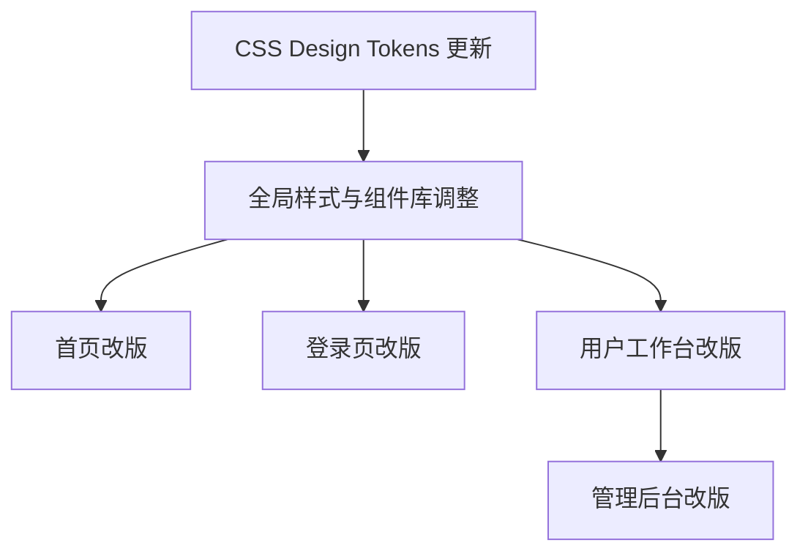

# DemoGo iOS 极简风改版 — 任务分解计划

> **版本**: v1.0  
> **品牌色**: `#06B6D4` → `#22C55E` 翠绿  
> **设计风格**: iOS 极简风（Marvis / Apple.com 类）  
> **参考设计**: `deliverables/demogo-{landing,login,dashboard,admin,preview}-ios.html`  
> **设计规格**: `deliverables/DEMOGO-DESIGN-SPEC.md`  

---

## 一、技术方案概述

### 1.1 设计系统变更

| 维度 | 当前状态 (v2 打磨版) | 目标状态 (iOS 极简风) |
|------|----------------------|----------------------|
| **品牌色** | `--cyan-500: #06B6D4`（青色系） | `--accent: #22C55E`（翠绿） |
| **配色体系** | 多色渐变（青→蓝→靛→紫） | 单色系 + 灰色调（Apple 风格） |
| **字体栈** | `Inter, -apple-system, ...` + mono | `-apple-system, SF Pro, Inter` 无 mono |
| **导航栏** | `64px` 高度, 复杂玻璃态 | `48px` 高度, 简洁毛玻璃 |
| **按钮** | 渐变背景 + 复杂阴影 | 纯色填充 + 简单动效 |
| **圆角** | `--r-2xl: 20px`, 卡片 20px | `--radius-md: 18px`, `--radius-pill: 100px` |
| **阴影** | 多层叠加阴影 + 彩色阴影 | 简洁阴影（Apple 风格） |
| **卡片** | 毛玻璃背景 + 渐变上边装饰线 | 纯白背景 + 绿色边框悬浮态 |
| **动效** | CSS `cubic-bezier(0.4,0,0.2,1)` | `cubic-bezier(.25,0,.15,1)` Apple 缓动 |

### 1.2 架构影响

- **CSS 架构不变**：继续使用 CSS 变量 + 独立样式文件方案（不引入 CSS-in-JS）
- **组件层重构**：`BrandLogo`、`Button`、`Card` 等基础组件需要重新设计
- **React 组件结构不变**：页面组件和业务逻辑保持不变，仅修改 JSX 结构和样式
- **零新增依赖**：所有效果纯 CSS 实现，无需新增 npm 包

### 1.3 页面改动幅度

| 页面 | 改动幅度 | 说明 |
|------|---------|------|
| 首页 (HomePage) | **大改** | Hero 结构、Feature 卡片、新增 Mockup、Metrics、CTA 区 |
| 登录页 (LoginPage) | **中改** | 布局精简，颜色调整，按钮样式 |
| 用户工作台 (UserDashboard) | **中改** | Sidebar 样式、统计卡片、作品列表 |
| 管理后台 (AdminDashboard) | **中改** | Sidebar 样式、统计卡片、表格、审核项 |
| 预览页 | **新增** | 可新增 DemoPreviewPage.tsx |

---

## 二、任务列表（按依赖顺序）

### T1: CSS Design Tokens 更新 — 品牌色 #06B6D4 → #22C55E

**目标**: 将全局设计令牌从青色系切换为绿色系，更新所有 CSS 变量，建立 iOS 风格设计系统。

**受影响文件**:

| 文件 | 操作 |
|------|------|
| `src/styles/design-tokens.css` | **重写** — 替换所有 color tokens，更新阴影/圆角/动画变量 |
| `src/styles/global.css` | **修改** — 更新品牌色引用、按钮样式、导航样式、卡片样式、焦点环、选择色、骨架屏 |
| `src/styles/home.css` | **修改** — 更新所有 cyan/electric/indigo/violet 引用为 green/accent |
| `src/styles/auth.css` | **修改** — 更新所有 cyan/blue 引用为 green/accent |
| `src/styles/dashboard.css` | **修改** — 更新所有 cyan/electric/indigo 引用为 green/accent |
| `src/styles/auth.css` | **修改** — 更新所有 cyan/electric 引用为 green/accent |

**主要变更内容**:

```diff
- --cyan-50:  #ecfeff;
- --cyan-500: #06b6d4;
+ --green-50:  #f0fdf4;
+ --green-500: #22c55e;

- --accent: #06B6D4;
+ --accent: #22C55E;
- --accent-hover: #0891B2;
+ --accent-hover: #16A34A;
```

**依赖**: 无  
**优先级**: P0  

---

### T2: 全局样式与组件库 iOS 化调整

**目标**: 更新全局布局、按钮、卡片、表单、导航等组件样式，匹配 iOS 极简风设计规范。

**受影响文件**:

| 文件 | 操作 |
|------|------|
| `src/styles/global.css` | **修改** — 导航 `64px→48px`, 按钮样式 pill 化, 卡片简化, 圆角系统更新 |
| `src/components/Button.tsx` | **修改** — 使用 `btn-pill` 类，简化按钮变体 |
| `src/components/BrandLogo.tsx` | **修改** — 更新 SVG logo 颜色为 green, 文字使用 `◆DemoGo` 格式 |
| `src/components/Card.tsx` | **修改** — 简化卡片样式，移除毛玻璃背景 |
| `src/components/MetricCard.tsx` | **修改** — 更新统计卡片样式为 iOS Metrics 风格 |
| `src/components/Badge.tsx` | **修改** — 更新徽章颜色为 green 系 |
| `src/components/Toast.tsx` | **修改** — Toast 颜色同步为 green 系 |

**iOS 风格关键规范**:

```
导航栏:
  - height: 48px（原 64px）
  - padding: 0 40px
  - background: rgba(255,255,255,.88)
  - backdrop-filter: blur(20px)
  - border-bottom: 1px solid rgba(0,0,0,.06)

主按钮:
  - border-radius: 100px (pill 形状)
  - padding: 14px 30px
  - font-size: 15px, font-weight: 600
  - transition: cubic-bezier(.25,0,.15,1) 0.35s

卡片:
  - border-radius: 18px
  - padding: 40px 28px
  - border: 1px solid var(--border-light)
  - hover: border green + shadow-green + translateY(-3px)
```

**依赖**: T1  
**优先级**: P0  

---

### T3: 首页改版 (HomePage.tsx + home.css)

**目标**: 按照 `demogo-landing-ios.html` 重写首页，包含 Hero + Features + Steps + Metrics + CTA + Footer 完整结构。

**受影响文件**:

| 文件 | 操作 |
|------|------|
| `src/pages/HomePage.tsx` | **重写** — 替换所有 JSX 结构为 iOS 设计版本 |
| `src/styles/home.css` | **重写** — 替换所有样式为 iOS 风格 |
| `src/components/BrandLogo.tsx` | **引用** — 使用简化版 Logo |

**iOS 首页结构**:

```
Nav (sticky, 48px)
├─ ◆DemoGo (简化为 ◆ + Text, 无 SVG)
└─ Nav Links: [功能介绍] [使用流程] [免费使用]

Hero Section
├─ Badge: "免费内测中" (绿色圆点 + 文字)
├─ h1: "做完作品，直接扔个链接"
├─ p: 描述文字
├─ CTAs: [免费开始使用] [看看怎么玩 →]
└─ Mockup: macOS 风格窗口 → 项目→链接流程

Features Section (深灰背景 + 绿色光晕)
├─ Label: "核心功能"
├─ h2: "做完，发出去，就这么简单"
├─ p: 描述
└─ 3列卡片网格 (feat-card)
   ├─ ⚡ 秒上线
   ├─ 🔗 闭眼分享
   └─ 🛠️ 通吃所有工具

Steps Section (白色背景)
├─ Label: "就三步"
├─ h2: "比泡面还快"
└─ 3列步骤 (step-card with step-num 圆形数字)
   ├─ ① 做出东西
   ├─ ② 扔进 DemoGo
   └─ ③ 丢链接出去

Metrics Section (深灰背景)
├─ Label: "数据说话"
└─ 3列数据 (metric-row)
   ├─ 500+ 创作者已加入
   ├─ 2,300+ 本周生成的演示
   └─ 97% 愿意推荐给朋友

CTA Section (白色背景)
├─ Label: "还等什么？"
├─ h2: "你的下个作品，现在就发出去"
├─ CTA: [免费开始使用]
└─ Note: "无需信用卡，随时取消"

Footer
├─ Brand: ◆DemoGo + tagline
├─ Links: 产品(3) + 资源(3)
└─ Bottom: Copyright + Social
```

**CSS 关键组件**:
- `.nav` (48px, 毛玻璃)
- `.btn-pill` (pill 形状按钮)
- `.hero` (大标题 + green 光晕背景)
- `.feat-grid` / `.feat-card` (3列卡片网格)
- `.step-grid` / `.step-card` / `.step-num` (步骤)
- `.metric-row` / `.metric` (数据指标)
- `.footer` (页脚)

**依赖**: T2  
**优先级**: P0  

---

### T4: 登录页改版 (LoginPage.tsx + auth.css)

**目标**: 按照 `demogo-login-ios.html` 重写登录/注册页，精简设计。

**受影响文件**:

| 文件 | 操作 |
|------|------|
| `src/pages/LoginPage.tsx` | **修改** — 更新 JSX 结构，简化卡片布局 |
| `src/styles/auth.css` | **修改** — 重写登录页样式为 iOS 风格 |

**iOS 登录页结构**:

```
body (bg-section 灰色背景, 垂直居中)
└─ .card (白色卡片, max-width: 400px)
   ├─ Logo: ◆DemoGo
   ├─ Title: "欢迎回来"
   ├─ Sub: "登录后继续管理你的作品"
   ├─ .tabs (登录/免费注册 切换器)
   ├─ form
   │  ├─ 邮箱 input
   │  ├─ 密码 input
   │  └─ .btn-block (绿色全宽按钮)
   └─ footer-text: "还没有账号？免费注册 DemoGo"
```

**主要变更**:
- 移除渐变背景 → 纯 `var(--bg-section)`
- 移除 `login-kicker` cyan 色 → 使用 green
- 按钮背景 `#06B6D4` → `#22C55E`
- 输入框焦点色 `#06B6D4` → `#22C55E`
- 卡片阴影简化

**依赖**: T2  
**优先级**: P0  

---

### T5: 用户工作台改版 (UserDashboard.tsx + dashboard.css)

**目标**: 按照 `demogo-dashboard-ios.html` 重写用户工作台 UI。

**受影响文件**:

| 文件 | 操作 |
|------|------|
| `src/pages/UserDashboard.tsx` | **修改** — 更新布局结构（Sidebar + Main），引用子视图 |
| `src/pages/dashboard/Sidebar.tsx` | **修改** — 更新侧边栏样式为 iOS 风格 |
| `src/pages/dashboard/OverviewView.tsx` | **修改** — 更新概览视图样式 |
| `src/pages/dashboard/ProjectsView.tsx` | **修改** — 更新作品列表样式 |
| `src/pages/dashboard/WorkspaceHero.tsx` | **修改** — 更新工作区 Hero 样式 |
| `src/styles/dashboard.css` | **修改** — 重写工作台样式为 iOS 风格 |

**iOS 工作台结构**:

```
.dash (flex, min-height: 100vh)
├─ .sidebar (240px, sticky)
│  ├─ ◆DemoGo Logo
│  ├─ .sidebar-nav (导航项, emoji icon + 文字)
│  │  ├─ 📊 总览
│  │  ├─ 📁 我的作品
│  │  ├─ ⬆️ 上传发布
│  │  ├─ 🤖 AI 发布
│  │  ├─ 📋 发布记录
│  │  ├─ 💬 反馈收集
│  │  └─ 📦 套餐额度
│  └─ .sidebar-user (用户信息)
│     ├─ Avatar (绿色圆)
│     └─ Email + 套餐
└─ .main
   ├─ .main-header (h1 + sub + btn-pill)
   ├─ .stats-row (4列统计卡片)
   │  ├─ 在线作品: 3
   │  ├─ 本月发布: 7
   │  ├─ 总访问量: 1,284
   │  └─ 反馈数: 42
   ├─ .section-hdr: "最近作品"
   └─ .demo-list (作品行)
      ├─ .demo-row × 3
      │  ├─ .demo-dot (online/offline)
      │  ├─ .demo-info (name + meta)
      │  ├─ .demo-views (查看数)
      │  ├─ .demo-btn: 复制链接
      │  └─ .demo-btn: 详情
```

**主要变更**:
- Sidebar: 使用 emoji 图标替代 lucide-react icons
- 统计卡片: 简化阴影，hover 绿色边框
- 作品列表: 使用 `.demo-row` 替代复杂项目列表组件
- 颜色: 所有 cyan 引用 → green

**依赖**: T2  
**优先级**: P1  

---

### T6: 管理后台改版 (AdminDashboard.tsx)

**目标**: 按照 `demogo-admin-ios.html` 重写管理后台 UI。

**受影响文件**:

| 文件 | 操作 |
|------|------|
| `src/pages/AdminDashboard.tsx` | **修改** — 更新布局结构 |
| `src/pages/admin/AdminSidebar.tsx` | **修改** — 更新侧边栏样式为 iOS 风格，添加 emoji 图标 |
| `src/pages/admin/AdminOverviewView.tsx` | **修改** — 更新概览视图样式 |
| `src/pages/admin/AdminUsers.tsx` | **修改** — 更新用户表格样式 |
| `src/pages/admin/AdminContentReviews.tsx` | **修改** — 更新审核列表样式 |
| `src/pages/admin/AdminPlanRequests.tsx` | **修改** — 更新升级申请列表样式 |
| `src/pages/admin/AdminDemosView.tsx` | **修改** — 更新 Demo 管理列表样式 |
| `src/pages/admin/AdminFeedback.tsx` | **修改** — 更新反馈列表样式 |
| `src/pages/admin/AdminForms.tsx` | **修改** — 更新表单管理样式 |
| `src/pages/admin/AdminSettings.tsx` | **修改** — 更新设置页面样式 |
| `src/styles/dashboard.css` | **修改** — 更新管理后台相关样式 |

**iOS 管理后台结构**:

```
.admin (flex, min-height: 100vh)
├─ .sidebar (240px, sticky)
│  ├─ ◆DemoGo 管理 Logo
│  ├─ .sidebar-nav
│  │  ├─ 📊 总览
│  │  ├─ 👥 用户管理 [12]
│  │  ├─ 📁 Demo 管理
│  │  ├─ 🔍 内容审核
│  │  ├─ 📬 反馈管理
│  │  ├─ 📋 表单管理
│  │  ├─ 📈 数据分析
│  │  └─ ⚙️ 系统设置
│  └─ .sidebar-user (管理员信息)
└─ .main
   ├─ .admin-header (h1 + search-box)
   ├─ .stats-grid (4列统计)
   ├─ .section-hdr: "最新注册用户"
   ├─ .table-wrap (用户表格)
   │  ├─ th: 用户/邮箱/套餐/状态/注册时间/操作
   │  └─ td: 数据行 + .status-tag + .action-btn
   ├─ .section-hdr: "内容审核"
   └─ .review-item × 2
      ├─ .review-status (待审核)
      ├─ .review-project
      └─ .review-actions [通过] [拒绝]
```

**主要变更**:
- Sidebar: 使用 emoji icons 替代纯文字
- Statistics: 更新为 iOS 统计卡片风格
- 表格: 使用 iOS style 表格样式
- 审核项: 使用 card 替代纯文本列表
- 颜色: 所有 cyan/blue/indigo 引用 → green

**依赖**: T2, T5（dashboard.css 中共享的管理后台样式）  
**优先级**: P1  

---

## 三、依赖关系图



## 四、共享知识 / 跨文件约定

### 4.1 CSS 变量命名约定

iOS 极简版使用以下 token 体系（与设计规格文档一致）：

```css
:root {
  /* 品牌色 */
  --accent: #22C55E;
  --accent-hover: #16A34A;
  --accent-subtle: rgba(34,197,94,.08);
  --accent-border: rgba(34,197,94,.2);

  /* 文字 */
  --text-primary: #1D1D1F;
  --text-secondary: #6E6E73;
  --text-tertiary: #86868B;
  --text-quaternary: #A1A1A6;

  /* 边框 */
  --border: #D2D2D7;
  --border-light: #E8E8ED;

  /* 阴影 */
  --shadow-sm: 0 1px 3px rgba(0,0,0,.04);
  --shadow-md: 0 4px 12px rgba(0,0,0,.06);
  --shadow-lg: 0 8px 24px rgba(0,0,0,.08);
  --shadow-green: 0 4px 20px rgba(34,197,94,.1);

  /* 圆角 */
  --radius-md: 18px;
  --radius-pill: 100px;
}
```

### 4.2 动效规范

- 默认缓动函数: `cubic-bezier(.25,0,.15,1)`（Apple 标准）
- 按钮过渡: `0.35s`
- 卡片过渡: `0.4s`
- 导航/链接: `0.2s`
- 动效安全: `@media (prefers-reduced-motion: reduce)` 禁用所有动画

### 4.3 按钮系统

```css
.btn-pill {
  display: inline-flex; align-items: center; justify-content: center;
  padding: 14px 30px; border-radius: var(--radius-pill);
  font-size: 15px; font-weight: 600;
  transition: all .35s cubic-bezier(.25,0,.15,1);
  cursor: pointer; border: none;
}
.btn-pill.primary { background: var(--accent); color: #fff; }
.btn-pill.primary:hover { background: var(--accent-hover); transform: scale(1.02); }
.btn-pill.primary:active { transform: scale(.97); }
.btn-pill.secondary {
  border: 1px solid var(--border); color: var(--text-primary); background: transparent;
}
.btn-pill.secondary:hover { border-color: var(--text-secondary); }
```

### 4.4 Logo 规范

iOS 版使用简化文字标志（无需 SVG）:
```
◆DemoGo
- ◆ 符号: color var(--accent), font-size 18px
- DemoGo 文字: font-size 16px, font-weight 700
```

### 4.5 响应式断点

| 断点 | 变化 |
|------|------|
| 900px | 导航 padding 缩小, 导航链接隐藏(仅保留 CTA), 3列→1列 |
| 480px | 按钮全宽 |

### 4.6 可访问性

- 所有装饰性图标: `aria-hidden="true"`
- 焦点样式: `:focus-visible` 绿色 outline
- 语义结构: `<nav>`, `<section>`, `<footer>`, `<h1-h4>`
- 选中样式: `::selection` 绿色半透明

---

## 五、新增依赖包

该改版**不引入新的 npm 包**。所有效果使用纯 CSS 实现。

| 包名 | 操作 | 原因 |
|------|------|------|
| `lucide-react` | 保留（Dashboard Sidebar 可能继续使用） | 部分图标仍被其他视图使用 |
| 字体 | 零外部请求 | 使用系统原生字体栈 |

---

## 六、实施建议

### 6.1 实施顺序建议

建议按 **T1 → T2 → T3 → T4 → T5 → T6** 的顺序实施，确保：
1. 先建立正确的设计 token 基础
2. 全局组件样式统一后再改页面
3. 首页作为最复杂的页面优先实施

### 6.2 风险提示

1. **颜色替换风险**: T1 中替换 `#06B6D4` → `#22C55E` 涉及大量 CSS 变量，建议使用全局搜索替换 + 人工复核
2. **兼容性**: 现有自定义组件（如 `UploadPanel`, `AgentPublishPanel` 等 dashboard 子视图）继承 dashboard.css 样式，修改时需确保不影响功能
3. **渐变移除**: 当前版本大量使用渐变效果（`gradient-text`, `btn-primary` 渐变背景），iOS 版将简化为纯色，需逐个检查移除

### 6.3 验收标准

| 页面 | 验收要点 |
|------|---------|
| 首页 | 与 `demogo-landing-ios.html` 视觉一致，响应式正常 |
| 登录页 | 与 `demogo-login-ios.html` 视觉一致 |
| 工作台 | 与 `demogo-dashboard-ios.html` 布局一致，功能完整 |
| 管理后台 | 与 `demogo-admin-ios.html` 布局一致，功能完整 |
| 全局 | 品牌色均为 #22C55E，无 #06B6D4 残留 |
